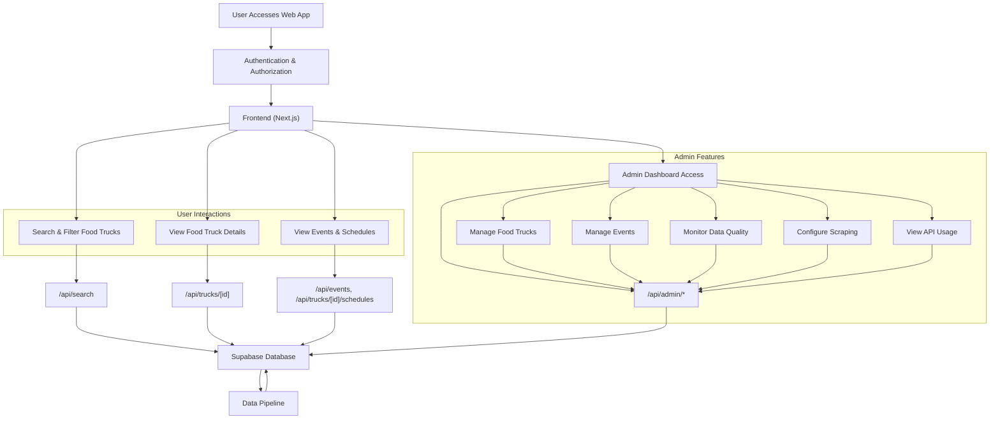
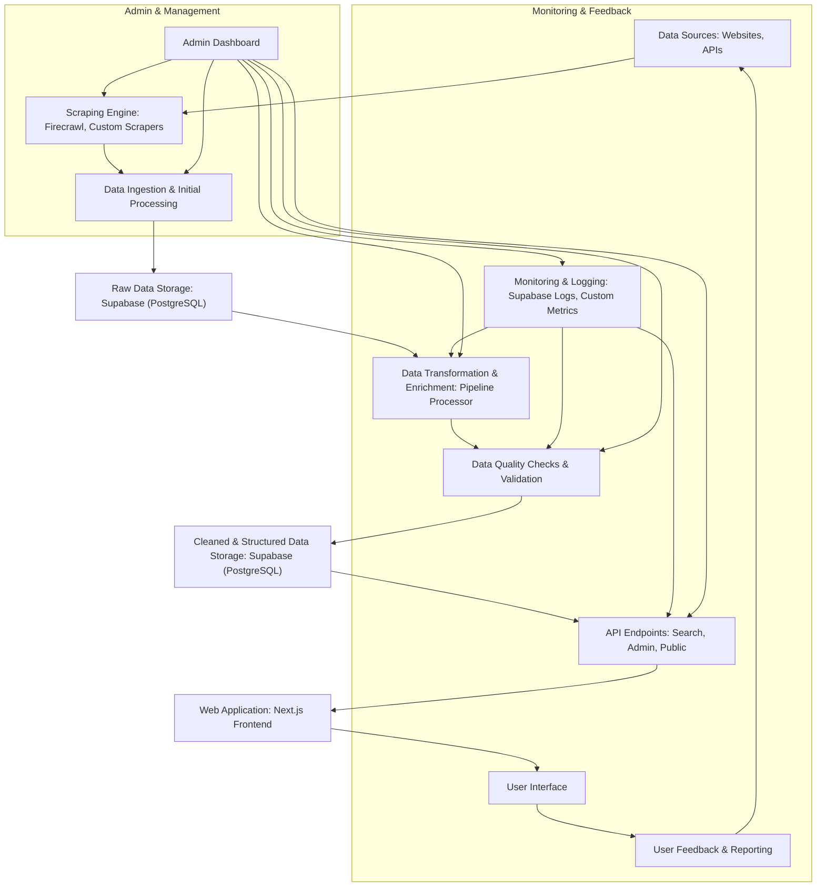

# Food Truck Finder Application

[](https://vercel.com/codedeficients-projects/v0-remote-web-server-design)
[](https://v0.dev/chat/projects/rQOrGwmrQGh)
[](https://www.typescriptlang.org/)
[](docs/ZERO_TRUST_VERIFICATION_PROTOCOL.md)
[](CONSOLIDATED_LAUNCH_READINESS_PLAN.md)

## 🚀 **Enterprise-Grade Food Truck Discovery Platform**

A modern, full-stack web application built with **professional-grade architecture** and **enterprise development standards**. Features an AI-powered data pipeline, comprehensive admin dashboard, and real-time food truck discovery capabilities.

**Built with Zero Trust Development Protocol** - Every code change verified through systematic quality gates to ensure production stability.

## Key Technologies

- **Framework**: Next.js (React)
- **Styling**: Tailwind CSS
- **State Management**: React Hooks
- **Backend & Database**: Next.js API Routes, Supabase (PostgreSQL, Auth, Storage, Edge Functions)
- **Web Scraping**: Firecrawl
- **AI-Powered Search**: Tavily AI
- **AI/ML**: Google Gemini API (`@google/genai`)
- **Mapping**: Leaflet, React-Leaflet
- **UI Components**: Radix UI, Shadcn UI
- **Testing**: Playwright (E2E), Jest (Unit/Integration)
- **Type Safety**: TypeScript

## Features

- **Food Truck Discovery**: Easily find food trucks based on location, cuisine type, and operating status.
- **Detailed Information**: View comprehensive details for each food truck, including menus, operating hours, contact information, and social media links.
- **Real-time Updates**: Get live updates on food truck locations and availability.
- **Advanced Search & Filtering**: Robust search capabilities with filters for cuisine type, price range, and operating status.
- **Event & Schedule Management**: Integration for food truck events and operating schedules.
- **User Profiles**: Personalized user profiles for enhanced experience.
- **Data Quality Metrics**: Built-in functions and dashboards to monitor and ensure data quality.
- **Comprehensive Security**: Implemented security hardening measures across the application and database.
- **Admin Dashboard**: A secure and comprehensive interface for administrators, currently under active development. It includes:
  - **Food Truck Management**: CRUD operations for food truck data.
  - **User Management**: Oversee and manage user accounts.
  - **Data Pipeline Monitoring**: Track scraping jobs, data quality, and automated cleanup processes.
  - **System Metrics & Alerts**: Real-time monitoring of application performance and system health, with configurable alerts.
  - **Analytics**: Insights into application usage and food truck popularity.
  - **Test Pipeline**: Tools for testing data scraping and processing pipelines.

## AI-Powered Data Pipeline

The backbone of the Food Truck Finder is its intelligent, automated data pipeline. This system is responsible for discovering, processing, and storing food truck data from various online sources.

### Key Components:

- **Tavily AI for Intelligent Discovery**: The pipeline uses Tavily's AI-powered search API to intelligently discover new food trucks and their websites. This allows for a more efficient and targeted approach to data acquisition compared to traditional web scraping.
- **Firecrawl for Web Scraping**: Once a potential food truck website is identified, Firecrawl is used to reliably scrape the necessary data, such as menus, operating hours, and contact information. Firecrawl's robust infrastructure ensures a high success rate and handles the complexities of web scraping.
- **Gemini AI for Data Extraction**: The scraped data is then processed by Google's Gemini AI, which extracts and structures the information into a consistent format.
- **Supabase for Data Storage**: The cleaned and structured data is stored in a Supabase PostgreSQL database, providing a reliable and scalable data storage solution.

## Architecture Diagrams

### Web Application Workflow



### Enhanced Data Pipeline Architecture



## 🏗️ **Professional Project Structure**

Built with **enterprise-grade architecture** following industry best practices:

```
food-truck-finder/
├── 📁 app/                    # Next.js App Router (pages & API routes)
├── 📁 components/             # Reusable UI components
│   ├── admin/                 # Admin dashboard components
│   ├── home/                  # Home page components
│   ├── search/                # Search & filtering components
│   ├── trucks/                # Food truck display components
│   └── ui/                    # Base UI components (Shadcn/Radix)
├── 📁 lib/                    # Core utilities & business logic
│   ├── api/                   # API route handlers
│   ├── auth/                  # Authentication utilities
│   ├── data-quality/          # Data validation & cleanup
│   ├── gemini/                # AI integration (Google Gemini)
│   ├── pipeline/              # Data processing pipeline
│   ├── security/              # Security utilities
│   └── supabase/              # Database services
├── 📁 hooks/                  # Custom React hooks
├── 📁 types/                  # TypeScript type definitions
├── 📁 public/                 # Static assets
├── 📁 styles/                 # Global styles & themes
├── 📁 docs/                   # Comprehensive documentation
│   ├── analysis/              # Code analysis reports
│   ├── baselines/             # Test baselines
│   ├── debug/                 # Debug documentation
│   └── errors/                # Error documentation
├── 📁 tests/                  # Test suite
│   ├── config/                # Test configurations
│   └── results/               # Test results & reports
├── 📁 scripts/                # Development & deployment scripts
├── 📁 supabase/               # Database schema & migrations
└── 📄 [config files]          # Essential configuration only
```

### **Key Architectural Decisions**
- **High TypeScript Coverage**: ~82% of the codebase is TypeScript, with a goal of 100% type safety.
- **Professional Code Organization**: Clear separation of concerns
- **Comprehensive Documentation**: Enterprise-grade documentation
- **Zero Trust Development**: Every change verified through quality gates
- **Clean Root Directory**: Only essential files in project root

---

## 🎯 **Quality Assurance**

### **Code Quality Metrics**
- **TypeScript Coverage**: 100% (Zero compilation errors)
- **ESLint Status**: 57 issues remaining (down from 135+)
- **Build Success**: 100% success rate
- **Test Coverage**: Comprehensive E2E and unit tests
- **Professional Standards**: Enterprise-grade architecture

### **Development Standards**
- **[Zero Trust Verification Protocol](docs/ZERO_TRUST_VERIFICATION_PROTOCOL.md)**: Every change verified
- **[Launch Readiness Plan](CONSOLIDATED_LAUNCH_READINESS_PLAN.md)**: Production deployment ready
- **[Professional Codebase Analysis](CODEBASE_STRUCTURE_ANALYSIS.md)**: Structure optimization

---

## 📜 License

This project is licensed under the **[Business Source License 1.1](LICENSE)**.

**Key points:**
- ✅ **Free for personal, educational, and non-profit use**
- ⚠️ **Commercial food service platforms require a commercial license**
- 🎯 **Converts to Apache 2.0 in 2029** (fully open source)

See the [LICENSE](LICENSE) file for complete terms and commercial use definitions.

**Commercial licensing:** user@example.com

---

## Installation

To set up the project locally, follow these steps:

1.  **Clone the repository**:
    ```bash
    git clone https://github.com/codedeficients/food-truck-finder-poc.git
    cd food-truck-finder-poc
    ```
2.  **Install dependencies**:
    ```bash
    npm install
    # or using pnpm
    pnpm install
    ```
3.  **Set up Environment Variables**:
    Create a `.env.local` file by copying the example file:

    ```bash
    cp .env.local.example .env.local
    ```

    Then, fill in the required environment variables in the `.env.local` file. Refer to the comments in the `.env.local.example` file for guidance on where to find the necessary API keys and other values.

4.  **Run Database Migrations**:
    Ensure your Supabase database is set up and run any pending migrations. You can apply migrations using the Supabase CLI:
    ```bash
    npx supabase db push
    ```

## Usage

To run the application in development mode:

```bash
npm run dev
# or using pnpm
pnpm dev
```

The application will be accessible at `http://localhost:3000`.

## Contributing

We welcome contributions to the Food Truck Finder Application! Please follow these guidelines:

1.  Fork the repository.
2.  Create a new branch for your feature or bug fix: `git checkout -b feature/your-feature-name` or `bugfix/your-bug-fix`.
3.  Make your changes and ensure they adhere to our [Linting and Code Quality Guide](docs/LINTING_AND_CODE_QUALITY_GUIDE.md).
4.  Write tests for your changes.
5.  Ensure all tests pass and linting checks are clear.
6.  Commit your changes with a descriptive message.
7.  Push your branch and open a pull request.

## Local Development & Debugging

### Development Scripts

The `package.json` includes a variety of scripts to streamline development, testing, and quality assurance:

- **Linting & Formatting**:
  - `npm run lint`: Runs ESLint on all `.js`, `.jsx`, `.ts`, `.tsx` files.
  - `npm run lint:fix`: Automatically fixes linting errors.
  - `npm run lint:count`: Counts the total number of linting errors.
  - `npm run format`: Formats code using Prettier.
- **Testing**:
  - `npm run test`: Runs Jest unit/integration tests.
  - `npm run test:coverage`: Runs Jest tests with code coverage.
  - `npm run test:e2e`: Runs Playwright E2E tests (basic).
  - `npm run test:e2e:playwright`: Runs all Playwright tests.
  - `npm run test:e2e:pipeline`: Runs Playwright tests specific to the data pipeline.
  - `npm run test:e2e:upscaling`: Runs Playwright tests for pipeline upscaling.
  - `npm run test:e2e:load`: Runs Playwright load tests for the pipeline.
  - `npm run test:e2e:monitoring`: Runs Playwright tests for monitoring features.
  - `npm run test:pipeline:all`: Runs all Playwright pipeline-related E2E tests.
  - `npm run test:e2e:all`: Runs all Playwright E2E tests.
  - `npm run test:e2e:report`: Shows the Playwright test report.
  - `npm run test:setup`: Runs setup scripts for testing.
  - `npm run test:pipeline:health`: Runs Playwright tests specifically for the System Health Dashboard.
- **Quality Gates & Type Checking**:
  - `npm run quality:gates`: Executes quality gate checks (e.g., linting, type checking).
  - `npm run quality:check`: Runs type checking and linting.
  - `npm run quality:fix`: Fixes linting errors and runs type checking.
  - `npm run type-check`: Performs TypeScript type checking.
  - `npm run type-coverage`: Checks TypeScript type coverage (at least 95%).
  - `npm run complexity:check`: Checks for cognitive complexity violations.
- **Error & Baseline Management**:
  - `npm run error:count`: Counts current linting errors.
  - `npm run baseline:capture`: Captures a baseline of current errors.
  - `npm run baseline:compare`: Compares current errors against the baseline.
- **OAuth Flow Testing**:
  - `npm run oauth:verify`: Verifies OAuth setup.
  - `npm run oauth:test`: Tests the OAuth flow.
  - `npm run oauth:test:dev`: Tests OAuth flow in development environment.
  - `npm run oauth:test:prod`: Tests OAuth flow in production environment.
- **Monitoring**:
  - `npm run monitoring:update`: Updates monitoring configurations.
- **TypeScript Migration (ts-migrate)**:
  - `npm run ts-migrate:init`: Initializes `ts-migrate`.
  - `npm run ts-migrate:migrate`: Migrates JavaScript to TypeScript.
  - `npm run ts-migrate:reignore`: Re-ignores files for `ts-migrate`.

### Browser Debugging with browser-tools-mcp

This project uses [browser-tools-mcp](https://github.com/AgentDeskAI/browser-tools-mcp) for local browser-based debugging and inspection. To use:

1.  Open the Command Palette in VS Code (`Ctrl+Shift+P`).
2.  Search for and run `Browser Tools: Open Browser`.
3.  Use the browser window to interact with your app at `http://localhost:3000` (or your dev server URL).
4.  Use the browser-tools-mcp sidebar for DOM inspection, console, network, and accessibility audits.

See the [browser-tools-mcp documentation](https://github.com/AgentDeskAI/browser-tools-mcp) for advanced features and troubleshooting.

### Pre-commit Hooks with Husky and lint-staged

This project uses [Husky](https://typicode.github.io/husky/) to manage Git hooks and [lint-staged](https://github.com/okonet/lint-staged) to run linters on staged files, ensuring code quality and consistency before commits.

**How it works:**

- When you attempt to commit changes, Husky triggers the pre-commit hook.
- The pre-commit hook executes `pnpm exec lint-staged`.
- `lint-staged` then runs configured linters (`eslint --fix` and `prettier --write`) only on the files you've staged for commit.
- This process helps catch errors and enforce formatting standards automatically before code is added to the repository.

**Setup:**

1.  Husky and `lint-staged` are installed as dev dependencies.
2.  Husky is initialized (via `pnpm husky init` or automatically by the `prepare` script in `package.json`).
3.  The `.husky/pre-commit` hook is configured to run `pnpm exec lint-staged`.
4.  The `lint-staged` configuration in `package.json` specifies which commands to run on which file types.

## 📚 **Documentation**

This project is documented using the standard **7-document model** for professional software engineering projects.

| Document | Purpose |
|----------|----------|
| **[📝 Product Requirements (PRD)](docs/PRODUCT_REQUIREMENTS.md)** | What we're building, for whom, and why. |
| **[🛠️ Tech Stack](docs/TECH_STACK.md)** | The technologies used in the project. |
| **[🏗️ System Architecture](docs/ARCHITECTURE.md)** | The blueprint of the system. |
| **[🎨 Frontend Guide](docs/FRONTEND_GUIDE.md)** | A guide to the frontend codebase. |
| **[⚙️ Backend Guide](docs/BACKEND_GUIDE.md)** | A guide to the backend codebase. |
| **[📡 API Reference](docs/API_REFERENCE.md)** | Detailed documentation for all API endpoints. |
| **[🤝 Contributing Guide](docs/CONTRIBUTING.md)** | How to contribute to the project. |

### **Professional Standards**
- ✅ **Enterprise-grade documentation** indistinguishable from professional teams
- ✅ **Visual diagrams** for complex processes and architectures  
- ✅ **Comprehensive API reference** with examples and error handling
- ✅ **Zero Trust development protocol** ensuring code quality
- ✅ **Professional project structure** analysis and optimization

## 🔬 SOTA RESEARCH FINDINGS & IMPLEMENTATION GUIDELINES

### Next.js & TypeScript Best Practices (2024-2025)

#### Code Quality Standards

- **ESLint Configuration**: Use `next/core-web-vitals` and `next/typescript` for optimal linting
- **Type Safety**: Leverage TypeScript for enhanced type safety and early error detection
- **Error Boundaries**: Implement graceful error handling with proper error boundaries
- **Performance**: Use `unstable_cache` with tags for efficient data caching strategies

#### Development Workflow

- **Incremental Development**: Small, atomic changes with frequent linting verification
- **Testing Strategy**: Comprehensive unit, integration, and E2E testing
- **Code Organization**: Modular folder structure with clear separation of concerns
- **Documentation**: JSDoc comments for complex functions and comprehensive API documentation

### Food Truck Finder Application Best Practices

#### Data Pipeline Excellence

- **Web Scraping Ethics**: Respect robots.txt, implement rate limiting, and follow platform terms
- **Data Quality Framework**: Implement comprehensive data validation and quality scoring
- **Real-time Updates**: Use Server-Sent Events or WebSocket for live data updates
- **Error Handling**: Robust error handling with retry mechanisms and graceful degradation

#### Security & Performance

- **Authentication**: Implement SOTA authentication patterns with proper session management
- **Rate Limiting**: Intelligent rate limiting with backoff strategies for API calls
- **Caching Strategy**: Multi-layer caching with appropriate invalidation strategies
- **Monitoring**: Comprehensive monitoring with real-time alerts and performance tracking
