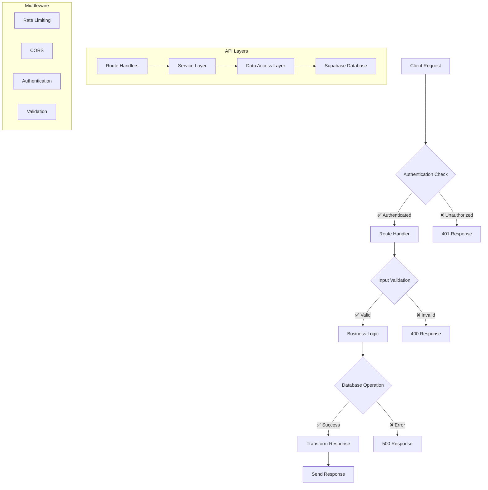

# API Documentation

## 📡 **Food Truck Finder API Reference**

This document provides comprehensive documentation for all API endpoints in the Food Truck Finder application.

---

## 🏗️ **API Architecture**



---

## 🔐 **Authentication**

### **Authentication Methods**
- **Session-based**: Supabase Auth with NextAuth
- **API Key**: For server-to-server communication
- **Role-based**: User, Admin, Super Admin permissions

### **Authentication Headers**
```http
Authorization: Bearer <jwt_token>
Content-Type: application/json
```

---

## 🛣️ **Public API Endpoints**

### **Search Food Trucks**
```http
GET /api/search
```

**Query Parameters:**
- `query` (string): Search term for food truck names
- `cuisine` (string): Filter by cuisine type
- `location` (string): Geographic location filter
- `radius` (number): Search radius in miles
- `isOpen` (boolean): Filter by current operating status
- `priceRange` (string): Filter by price range (1-4)
- `limit` (number): Maximum results (default: 50)
- `offset` (number): Pagination offset

**Example Request:**
```bash
curl -X GET "https://your-app.com/api/search?query=taco&location=Seattle&radius=10&isOpen=true" \
     -H "Content-Type: application/json"
```

**Response:**
```json
{
  "success": true,
  "data": {
    "trucks": [
      {
        "id": "truck-123",
        "name": "Taco Paradise",
        "description": "Authentic Mexican street tacos",
        "location": {
          "lat": 47.6062,
          "lng": -122.3321,
          "address": "123 Main St, Seattle, WA"
        },
        "cuisine_types": ["Mexican", "Street Food"],
        "price_range": 2,
        "operating_hours": {
          "monday": { "open": "11:00", "close": "21:00" }
        },
        "is_open": true,
        "rating": 4.5,
        "contact_info": {
          "phone": "+1-555-0123",
          "email": "hello@tacoparadise.com",
          "website": "https://tacoparadise.com"
        }
      }
    ],
    "total": 1,
    "pagination": {
      "limit": 50,
      "offset": 0,
      "hasMore": false
    }
  }
}
```

### **Get Food Truck Details**
```http
GET /api/trucks/[id]
```

**Path Parameters:**
- `id` (string): Unique food truck identifier

**Example Request:**
```bash
curl -X GET "https://your-app.com/api/trucks/truck-123" \
     -H "Content-Type: application/json"
```

**Response:**
```json
{
  "success": true,
  "data": {
    "id": "truck-123",
    "name": "Taco Paradise",
    "description": "Authentic Mexican street tacos with fresh ingredients",
    "long_description": "Founded in 2018, Taco Paradise brings authentic...",
    "location": {
      "lat": 47.6062,
      "lng": -122.3321,
      "address": "123 Main St, Seattle, WA",
      "city": "Seattle",
      "state": "WA",
      "zip_code": "98101"
    },
    "cuisine_types": ["Mexican", "Street Food"],
    "price_range": 2,
    "menu": [
      {
        "category": "Tacos",
        "items": [
          {
            "name": "Carnitas Taco",
            "description": "Slow-cooked pork with cilantro and onions",
            "price": 3.50,
            "image_url": "https://example.com/carnitas.jpg"
          }
        ]
      }
    ],
    "operating_hours": {
      "monday": { "open": "11:00", "close": "21:00", "is_closed": false },
      "tuesday": { "open": "11:00", "close": "21:00", "is_closed": false }
    },
    "contact_info": {
      "phone": "+1-555-0123",
      "email": "hello@tacoparadise.com",
      "website": "https://tacoparadise.com"
    },
    "social_media": {
      "facebook": "tacoparadise",
      "instagram": "tacoparadise_official",
      "twitter": "tacoparadise"
    },
    "images": [
      "https://example.com/truck1.jpg",
      "https://example.com/food1.jpg"
    ],
    "rating": 4.5,
    "review_count": 127,
    "created_at": "2024-01-15T10:30:00Z",
    "updated_at": "2024-12-18T15:45:00Z"
  }
}
```

---

## 👑 **Admin API Endpoints**

**Authentication Required**: Admin role or higher

### **Admin Dashboard Data**
```http
GET /api/admin/dashboard
```

**Response:**
```json
{
  "success": true,
  "data": {
    "stats": {
      "total_trucks": 150,
      "active_trucks": 120,
      "total_users": 1500,
      "active_jobs": 5
    },
    "recent_activity": [
      {
        "type": "truck_added",
        "message": "New food truck 'Burger Express' added",
        "timestamp": "2024-12-18T10:30:00Z"
      }
    ],
    "system_health": {
      "database": "healthy",
      "api": "healthy",
      "pipeline": "healthy"
    }
  }
}
```

### **Food Truck Management**
```http
GET /api/admin/food-trucks
POST /api/admin/food-trucks
PUT /api/admin/food-trucks/[id]
DELETE /api/admin/food-trucks/[id]
```

### **Data Quality Management**
```http
GET /api/admin/data-quality
```

**Response:**
```json
{
  "success": true,
  "data": {
    "overall_score": 85.5,
    "categories": {
      "completeness": {
        "score": 92.0,
        "issues": 15,
        "description": "Percentage of required fields populated"
      },
      "accuracy": {
        "score": 78.0,
        "issues": 45,
        "description": "Data accuracy based on validation rules"
      },
      "consistency": {
        "score": 88.5,
        "issues": 8,
        "description": "Data consistency across sources"
      }
    },
    "recent_issues": [
      {
        "type": "missing_phone",
        "truck_id": "truck-456",
        "severity": "medium",
        "detected_at": "2024-12-18T09:15:00Z"
      }
    ]
  }
}
```

### **Automated Cleanup**
```http
POST /api/admin/automated-cleanup
```

**Request Body:**
```json
{
  "operations": ["remove_duplicates", "fix_phone_formats", "geocode_addresses"],
  "batchSize": 100,
  "dryRun": false
}
```

### **Scraping Metrics**
```http
GET /api/admin/scraping-metrics
```

**Response:**
```json
{
  "success": true,
  "data": {
    "jobs": {
      "total": 1250,
      "successful": 1180,
      "failed": 70,
      "success_rate": 94.4
    },
    "recent_jobs": [
      {
        "id": "job-789",
        "status": "completed",
        "trucks_processed": 25,
        "duration": 180,
        "started_at": "2024-12-18T08:00:00Z",
        "completed_at": "2024-12-18T08:03:00Z"
      }
    ],
    "performance": {
      "avg_processing_time": 7.2,
      "avg_success_rate": 94.1,
      "data_freshness": "2024-12-18T08:30:00Z"
    }
  }
}
```

---

## 🔧 **Pipeline API Endpoints**

### **Test Pipeline Run**
```http
POST /api/test-pipeline-run
```

**Request Body:**
```json
{
  "stages": ["discovery", "scraping", "processing", "validation"],
  "config": {
    "max_trucks": 10,
    "timeout": 300,
    "validation_level": "strict"
  }
}
```

**Response:**
```json
{
  "success": true,
  "data": {
    "run_id": "run-abc123",
    "status": "running",
    "stages": [
      {
        "name": "discovery",
        "status": "completed",
        "duration": 45,
        "results": {
          "urls_found": 15,
          "valid_urls": 12
        }
      },
      {
        "name": "scraping",
        "status": "running",
        "progress": 60
      }
    ],
    "estimated_completion": "2024-12-18T10:45:00Z"
  }
}
```

### **Enhanced Pipeline**
```http
POST /api/enhanced-pipeline
```

**Request Body:**
```json
{
  "source_urls": ["https://example-truck.com"],
  "processing_options": {
    "enable_ai_extraction": true,
    "validate_data": true,
    "update_existing": true
  }
}
```

---

## 🔍 **Monitoring API Endpoints**

### **API Usage Statistics**
```http
GET /api/monitoring/api-usage
```

**Query Parameters:**
- `timeframe` (string): "24h", "7d", "30d" (default: "24h")
- `endpoint` (string): Filter by specific endpoint

**Response:**
```json
{
  "success": true,
  "data": {
    "timeframe": "24h",
    "total_requests": 15420,
    "endpoints": {
      "/api/search": {
        "requests": 8900,
        "avg_response_time": 150,
        "error_rate": 0.5
      },
      "/api/trucks/[id]": {
        "requests": 4200,
        "avg_response_time": 95,
        "error_rate": 0.2
      }
    },
    "performance": {
      "avg_response_time": 125,
      "p95_response_time": 280,
      "error_rate": 0.8
    }
  }
}
```

---

## 📊 **Analytics API Endpoints**

### **Web Vitals**
```http
POST /api/analytics/web-vitals
```

**Request Body:**
```json
{
  "name": "CLS",
  "value": 0.05,
  "rating": "good",
  "delta": 0.01,
  "id": "v3-1234567890",
  "url": "/trucks/truck-123",
  "user_agent": "Mozilla/5.0..."
}
```

---

## ⚠️ **Error Handling**

### **Standard Error Response**
```json
{
  "success": false,
  "error": {
    "code": "VALIDATION_ERROR",
    "message": "Invalid input parameters",
    "details": [
      {
        "field": "radius",
        "issue": "must be between 1 and 50"
      }
    ],
    "timestamp": "2024-12-18T10:30:00Z",
    "request_id": "req-abc123"
  }
}
```

### **HTTP Status Codes**
- `200` - Success
- `201` - Created
- `400` - Bad Request (invalid input)
- `401` - Unauthorized (authentication required)
- `403` - Forbidden (insufficient permissions)
- `404` - Not Found
- `429` - Too Many Requests (rate limited)
- `500` - Internal Server Error
- `503` - Service Unavailable

### **Error Codes**
- `VALIDATION_ERROR` - Invalid input parameters
- `AUTHENTICATION_REQUIRED` - No authentication provided
- `INSUFFICIENT_PERMISSIONS` - User lacks required permissions
- `RESOURCE_NOT_FOUND` - Requested resource doesn't exist
- `RATE_LIMIT_EXCEEDED` - Too many requests
- `INTERNAL_ERROR` - Server-side error
- `SERVICE_UNAVAILABLE` - Service temporarily unavailable

---

## 🔒 **Rate Limiting**

### **Default Limits**
- **Public API**: 100 requests per minute per IP
- **Authenticated API**: 1000 requests per minute per user
- **Admin API**: 5000 requests per minute per admin

### **Rate Limit Headers**
```http
X-RateLimit-Limit: 100
X-RateLimit-Remaining: 95
X-RateLimit-Reset: 1640000000
```

---

## 📝 **Request/Response Examples**

### **Complex Search Example**
```bash
curl -X GET "https://your-app.com/api/search" \
     -H "Content-Type: application/json" \
     -G \
     -d "query=burgers" \
     -d "location=New York, NY" \
     -d "radius=5" \
     -d "cuisine=American" \
     -d "priceRange=2-3" \
     -d "isOpen=true" \
     -d "limit=20"
```

### **Admin Batch Operation**
```bash
curl -X POST "https://your-app.com/api/admin/automated-cleanup" \
     -H "Authorization: Bearer ${ADMIN_TOKEN}" \
     -H "Content-Type: application/json" \
     -d '{
       "operations": ["remove_duplicates", "fix_phone_formats"],
       "batchSize": 50,
       "dryRun": true
     }'
```

---

## 🧪 **Testing the API**

### **Using curl**
```bash
# Test public search
curl -X GET "http://localhost:3000/api/search?query=pizza"

# Test truck details
curl -X GET "http://localhost:3000/api/trucks/truck-123"
```

### **Using Postman**
Import our [Postman Collection](docs/postman/food-truck-finder.postman_collection.json) for comprehensive API testing.

### **Using Playwright**
```bash
# Run API tests
npm run test:e2e:api
```

---

## 📈 **Performance Considerations**

### **Optimization Strategies**
- **Caching**: Response caching for frequently accessed data
- **Pagination**: All list endpoints support pagination
- **Field Selection**: Use `fields` parameter to limit response size
- **Compression**: Gzip compression enabled
- **Database Indexing**: Optimized database queries

### **Best Practices**
- Use pagination for large datasets
- Implement client-side caching where appropriate
- Handle rate limiting gracefully
- Always validate input parameters
- Use appropriate HTTP methods and status codes

---

## 🔧 **Development & Testing**

### **Local Development**
```bash
# Start development server
npm run dev

# API available at:
# http://localhost:3000/api/*
```

### **Environment Variables**
Required environment variables for API functionality:
- `SUPABASE_URL`
- `SUPABASE_ANON_KEY`
- `SUPABASE_SERVICE_ROLE_KEY`
- `NEXTAUTH_SECRET`

**The Food Truck Finder API provides a comprehensive, well-documented interface for all food truck discovery and management operations.**
