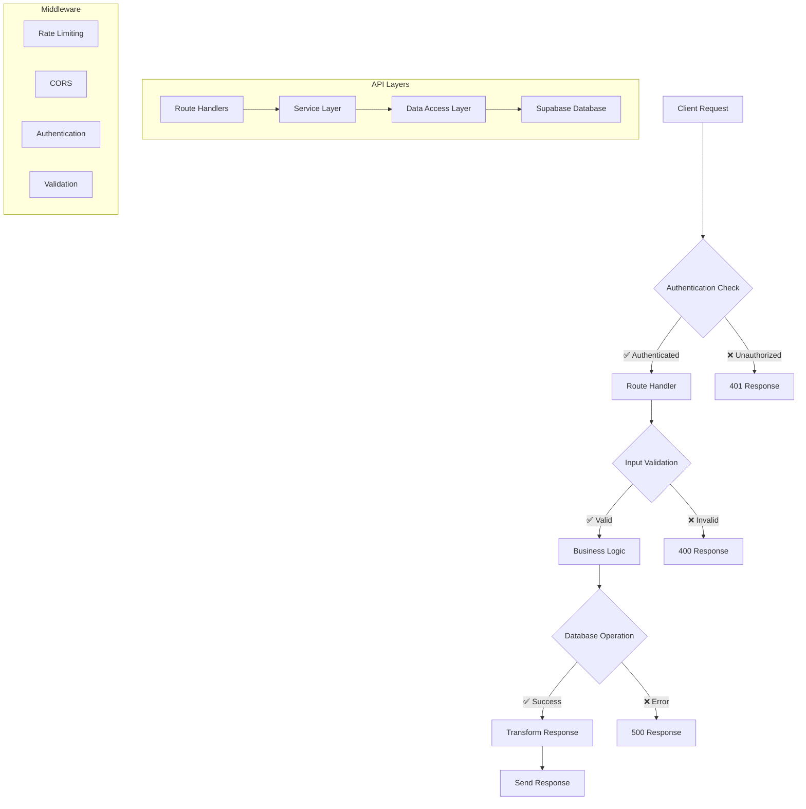

# 📡 API Reference

This document provides comprehensive documentation for all API endpoints in the Food Truck Finder application.

---

## 🏗️ **API Architecture**



---

## 🔑 **Key Design Principles**

- **Autonomous First**: The system is designed around autonomous agents and cron jobs to minimize manual intervention and ensure data freshness.
- **Resilience & Fallbacks**: Every external dependency, especially AI services, has a defined fallback strategy to ensure high availability of the core service.
- **Monitor Everything**: We believe you cannot manage what you do not measure. The API includes comprehensive endpoints for monitoring system health, API usage, and data pipeline performance.
- **Scalability by Default**: Built on a serverless architecture to handle variable load without performance degradation.

---

## 🔐 **Authentication**

### **Authentication Methods**
- **Session-based**: Supabase Auth with NextAuth
- **API Key**: For server-to-server communication
- **Role-based**:
    - **User**: Standard access for public consumers. Can view all public data.
    - **Admin**: Can manage food trucks, view system metrics, and trigger manual pipeline jobs. This role is for our trusted team members and eventually for paying food truck owners.
    - **Super Admin**: Has full system control, including the ability to manage users and system-wide configurations.

### **Authentication Headers**
```http
Authorization: Bearer <jwt_token>
Content-Type: application/json
```

---

## 🛣️ **Public API Endpoints**

### **Search Food Trucks**
```http
GET /api/search
```

**Query Parameters:**
- `q` (string, optional): Search term for food truck names.
- `cuisine` (string, optional): Filter by cuisine type.
- `openNow` (boolean, optional): Filter for food trucks that are currently open.
- `lat` (number, optional): Latitude for location-based search.
- `lng` (number, optional): Longitude for location-based search.
- `radius` (number, optional): Search radius in kilometers.

**Example Request:**
```bash
curl -X GET "https://your-app.com/api/search?q=taco&lat=47.6062&lng=-122.3321&radius=10&openNow=true" \
     -H "Content-Type: application/json"
```

**Response:**
```json
{
  "trucks": [
    {
      "id": "truck-123",
      "name": "Taco Paradise",
      "description": "Authentic Mexican street tacos",
      "current_location": {
        "lat": 47.6062,
        "lng": -122.3321,
        "address": "123 Main St, Seattle, WA",
        "timestamp": "2024-01-01T12:00:00Z"
      },
      "cuisine_type": ["Mexican", "Street Food"],
      "price_range": "$$",
      "data_quality_score": 95
    }
  ],
  "total": 1,
  "filters": {
    "query": "taco",
    "cuisine": null,
    "openNow": true,
    "location": {
      "lat": 47.6062,
      "lng": -122.3321
    },
    "radius": 10
  }
}
```

### **Create Food Truck**
```http
POST /api/trucks
```

**Request Body:**
A `FoodTruck` object without the `id`, `created_at`, and `updated_at` fields.

**Response:**
A JSON object containing a success message and the newly created `FoodTruck` object.

### **Update Food Truck**
```http
PUT /api/trucks/[id]
```

**Authentication Required**: Admin role or higher

**Path Parameters:**
- `id` (string): Unique food truck identifier

**Request Body:**
A partial `FoodTruck` object with the fields to update.

**Response:**
A JSON object containing a success message and the updated `FoodTruck` object.

### **Get All Food Trucks**
```http
GET /api/trucks
```

**Description:**
Retrieves a paginated list of all food trucks in the system.

**Query Parameters:**
- `limit` (number, optional, default: 50): The maximum number of food trucks to return.
- `offset` (number, optional, default: 0): The number of food trucks to skip before starting to collect the result set.

**Response:**
A JSON object containing a list of all food trucks, along with the total count.
```json
{
  "trucks": [
    {
      "id": "truck-123",
      "name": "Taco Paradise",
      "description": "Authentic Mexican street tacos",
      "cuisine_type": ["Mexican", "Street Food"]
    }
  ],
  "total": 1
}
```

### **Get Food Truck Details**
```http
GET /api/trucks/[id]
```

**Path Parameters:**
- `id` (string): Unique food truck identifier

**Example Request:**
```bash
curl -X GET "https://your-app.com/api/trucks/truck-123" \
     -H "Content-Type: application/json"
```

**Response:**
A JSON object containing the `FoodTruck` object.
```json
{
  "truck": {
    "id": "truck-123",
    "name": "Taco Paradise",
    "description": "Authentic Mexican street tacos with fresh ingredients",
    "current_location": {
      "lat": 47.6062,
      "lng": -122.3321,
      "address": "123 Main St, Seattle, WA",
      "timestamp": "2024-01-01T12:00:00Z"
    },
    "cuisine_type": ["Mexican", "Street Food"],
    "price_range": "$$",
    "data_quality_score": 95,
    "operating_hours": {
      "monday": { "open": "11:00", "close": "21:00" },
      "tuesday": { "open": "11:00", "close": "21:00" }
    },
    "menu": [
      {
        "name": "Tacos",
        "items": [
          {
            "name": "Carnitas Taco",
            "description": "Slow-cooked pork with cilantro and onions",
            "price": 3.50
          }
        ]
      }
    ]
  }
}
```

---

## 🤖 **Autonomous Agent & System Endpoints**

This collection of endpoints provides the backbone for the system's autonomous data processing, administrative control, and scheduled operations. They are designed for internal, trusted access and are essential for maintaining the health and quality of the food truck data.

### 👑 **Admin API Endpoints**

**Authentication Required**: Admin role or higher

#### **Admin Dashboard Data**
```http
GET /api/admin/dashboard
```

**Query Parameters:**
- `section` (string, optional): The specific section of the dashboard to retrieve. Can be one of `overview`, `scraping`, `processing`, `quality`, `usage`. If not provided, all sections are returned.

**Response:**
A JSON object containing the dashboard data. The structure of the response depends on the `section` query parameter.

**Example Response (no section specified):**
```json
{
  "overview": {
    "totalTrucks": 150,
    "recentTrucks": [
      {
        "id": "truck-123",
        "name": "Taco Paradise"
      }
    ],
    "averageQuality": 0.85,
    "verifiedTrucks": 120,
    "pendingTrucks": 30,
    "lastUpdated": "2024-01-01T12:00:00Z"
  },
  "scraping": {
    "pending": 10,
    "running": 2,
    "completedToday": 50,
    "failedToday": 5,
    "recentJobs": [],
    "successRate": 90.9
  },
  "processing": {
    "pending": 5,
    "processing": 1,
    "completedToday": 45,
    "failedToday": 2,
    "totalTokensUsed": 12345
  },
  "quality": {
    "total_trucks": 150,
    "avg_quality_score": 0.85,
    "high_quality_count": 100,
    "medium_quality_count": 40,
    "low_quality_count": 10,
    "verified_count": 120,
    "pending_count": 30,
    "flagged_count": 5
  },
  "usage": {
    "gemini": {
      "requests": {
        "used": 500,
        "limit": 1500,
        "remaining": 1000,
        "percentage": 33.3
      },
      "tokens": {
        "used": 10000,
        "limit": 32000,
        "remaining": 22000,
        "percentage": 31.25
      }
    },
    "firecrawl": {
      "requests": {
        "used": 100,
        "limit": 500,
        "remaining": 400,
        "percentage": 20
      }
    },
    "history": []
  },
  "timestamp": "2024-01-01T12:00:00Z"
}
```


#### **Data Quality Management**
```http
GET /api/admin/data-quality
POST /api/admin/data-quality
```

**Description:**
Provides endpoints for managing and assessing data quality.

**GET Request Query Parameters:**
- `action` (string, optional): The action to perform. Can be `stats` or `assess`. Defaults to `stats`.
- `truckId` (string, optional): The ID of the food truck to assess. Required if `action` is `assess`.

**GET Response:**
- If `action` is `stats` (or not provided), returns data quality statistics.
- If `action` is `assess`, returns the data quality assessment for the specified food truck.

**POST Request Body:**
- `action` (string): The action to perform. Can be `update-single`, `batch-update`, or `recalculate-all`.
- `truckId` (string, optional): The ID of the food truck to update. Required if `action` is `update-single`.

**POST Response:**
A JSON object containing a success message and data related to the performed action.

#### **Automated Cleanup**
```http
GET /api/admin/automated-cleanup
POST /api/admin/automated-cleanup
```

**Description:**
Provides endpoints for managing and executing automated data cleanup routines.

**GET Request Query Parameters:**
- `action` (string, optional): The action to perform. Can be `status`, `schedules`, `history`, or `preview`. Defaults to `status`.
- `limit` (number, optional): The maximum number of history records to return. Used with `action=history`.
- `operations` (string, optional): A comma-separated list of operations to preview. Used with `action=preview`.

**GET Response:**
- If `action` is `status` (or not provided), returns the overall cleanup status.
- If `action` is `schedules`, returns the list of cleanup schedules.
- If `action` is `history`, returns the cleanup history.
- If `action` is `preview`, returns a preview of the cleanup operations.

**POST Request Body:**
- `action` (string): The action to perform. Can be `run_scheduled`, `run_immediate`, `schedule_cleanup`, `update_schedule`, or `delete_schedule`.
- `options` (object, optional): The options for the action. The structure of this object depends on the `action`.

**POST Response:**
A JSON object containing a success message and data related to the performed action.

#### **Scraping Metrics**
```http
GET /api/admin/scraping-metrics
```

**Response:**
A JSON object containing real-time scraping metrics.
```json
{
  "success": true,
  "data": {
    "scrapingJobs": {
      "active": 2,
      "completed": 1180,
      "failed": 70,
      "pending": 10
    },
    "dataQuality": {
      "averageScore": 0.85,
      "totalTrucks": 150,
      "recentChanges": 5
    },
    "systemHealth": {
      "status": "healthy",
      "uptime": 3600,
      "lastUpdate": "2024-01-01T12:00:00Z"
    }
  },
  "timestamp": "2024-01-01T12:00:00Z"
}
```

### 🔧 **Pipeline API Endpoints**

#### **Test Pipeline Run**
```http
POST /api/test-pipeline-run
```

**Request Body:**
```json
{
  "url": "https://example.com/food-truck-page",
  "rawText": "Optional raw text to process instead of fetching the URL.",
  "isDryRun": true
}
```

**Response:**
A JSON object containing the results of the test pipeline run.
```json
{
  "results": {
    "firecrawl": {
      "status": "Success",
      "data": {
        "markdown": "..."
      }
    },
    "gemini": {
      "status": "Success",
      "data": {
        "name": "Taco Paradise"
      }
    },
    "supabase": {
      "status": "Success",
      "recordId": "truck-123"
    },
    "overallStatus": "Success",
    "logs": [
      "Test pipeline run started.",
      "..."
    ]
  }
}
```

#### **Enhanced Pipeline (DEPRECATED)**
```http
POST /api/enhanced-pipeline
```

**This endpoint is deprecated and will be removed in a future version. Please use `/api/pipeline` instead.**

**Response (410 Gone):**
```json
{
  "success": false,
  "error": "DEPRECATED: This endpoint has been consolidated",
  "migration": {
    "message": "Please use /api/pipeline instead",
    "newEndpoint": "/api/pipeline"
  }
}
```
### 🤖 **Data and AI/ML API Endpoints**

#### **Scraping Jobs**
```http
POST /api/scrape
GET /api/scrape
```

**Description:**
Provides endpoints for creating and monitoring scraping jobs.

**POST Request Body:**
- `url` (string): The URL to scrape.
- `type` (string, optional, default: 'website'): The type of scraping job.
- `priority` (number, optional, default: 5): The priority of the scraping job.

**POST Response:**
```json
{
  "message": "Scraping job created",
  "jobId": "...",
  "status": "pending"
}
```

**GET Request Query Parameters:**
- `jobId` (string, optional): The ID of a specific scraping job to retrieve.
- `status` (string, optional, default: 'pending'): The status of jobs to retrieve. Can be `all`, `pending`, `running`, `completed`, or `failed`.

**GET Response:**
- If `jobId` is provided, returns the specified scraping job.
- Otherwise, returns a list of scraping jobs with the specified status, along with a summary.

#### **Initiate Auto-Scraping Process**
```http
GET /api/auto-scrape-initiate
```

**Description:**
Initiates the auto-scraping process to ensure that default food trucks are scraped.

**Response:**
```json
{
  "message": "Auto-scraping process initiated and checked.",
  "results": "..."
}
```

#### **Trigger Generic Data Pipeline**
```http
GET /api/pipeline
```

**This endpoint is currently in development and not yet implemented.**

**Response (501 Not Implemented):**
```json
{
  "status": "not implemented",
  "message": "Pipeline API endpoint is in development"
}
```

#### **Interact with Gemini AI Model**
```http
POST /api/gemini
GET /api/gemini
```

**Description:**
Provides an interface to interact with the Gemini AI model for various tasks.

**POST Request Body:**
- `type` (string): The type of operation to perform. Can be `menu`, `location`, `hours`, `sentiment`, or `enhance`.
- `data` (string): The data to process.

**POST Response:**
A `GeminiResponse` object containing the result of the operation.

**GET Request Query Parameters:**
- `action` (string, optional): If `usage`, returns usage statistics for the Gemini API.

**GET Response:**
- If `action` is `usage`, returns usage statistics.
- Otherwise, returns a list of available endpoints.

### ⏰ **Cron Job Endpoints**

These endpoints are designed to be called by automated schedulers (cron jobs) to perform routine tasks.

#### **Auto-Scraping Cron Job**
```http
POST /api/cron/auto-scrape
```

**Description:**
The endpoint for the auto-scraping cron job. When triggered, it initiates the routine data scraping and processing cycle. It must be protected by a secret key passed in the `Authorization` header.

**Authorization:**
`Bearer <CRON_SECRET>`

**Response:**
```json
{
  "success": true,
  "message": "Auto-scraping completed successfully",
  "data": {
    "trucksProcessed": 10,
    "newTrucksFound": 2,
    "timestamp": "2024-01-01T12:00:00Z"
  }
}
```

#### **Data Quality Check Cron Job**
```http
POST /api/cron/quality-check
```

**Description:**
The endpoint for the data quality check cron job. It triggers a routine scan of the database to identify and report data quality issues. It must be protected by a secret key passed in the `Authorization` header.

**Authorization:**
`Bearer <CRON_SECRET>`

**Response:**
```json
{
  "success": true,
  "message": "Quality check completed successfully",
  "data": {
    "totalTrucks": 150,
    "trucksWithMissingData": 10,
    "lowQualityTrucks": 5,
    "staleDataCount": 20,
    "averageQualityScore": 0.85,
    "qualityBreakdown": {
      "high": 100,
      "medium": 45,
      "low": 5
    },
    "updateResults": {
      "updatedCount": 150,
      "errors": []
    },
    "timestamp": "2024-01-01T12:00:00Z"
  }
}
```

---


## 🔍 **Monitoring API Endpoints**

### **API Usage Statistics**
```http
GET /api/monitoring/api-usage
POST /api/monitoring/api-usage
```

**Description:**
Provides endpoints for monitoring API usage and managing alerts.

**GET Request Query Parameters:**
- `service` (string, optional): The specific API service to monitor.
- `action` (string, optional): If `check`, performs a dry run to see if a request can be made. Used with `service`.
- `requests` (number, optional): The number of requests to check. Used with `action=check`.
- `tokens` (number, optional): The number of tokens to check. Used with `action=check`.

**GET Response:**
- If `service` is not provided, returns a comprehensive monitoring result for all APIs.
- If `service` is provided, returns the current usage for that service.
- If `action` is `check`, returns whether a request can be made.

**POST Request Body:**
- `action` (string): The action to perform. Can be `clear-alerts`, `get-alerts`, or `test-alert`.
- `service` (string, optional): The service to test an alert for. Required if `action` is `test-alert`.
- `level` (string, optional): The severity level of the test alert. Required if `action` is `test-alert`.

**POST Response:**
A JSON object containing a success message and data related to the performed action.

---

## 📊 **Analytics API Endpoints**

### **Web Vitals**
```http
POST /api/analytics/web-vitals
GET /api/analytics/web-vitals
```

**Description:**
Provides endpoints for collecting and retrieving Web Vitals metrics.

**POST Request Body:**
A `WebVitalMetric` object.
```json
{
  "name": "CLS",
  "value": 0.05,
  "rating": "good",
  "timestamp": 1640995200000,
  "url": "/trucks/truck-123",
  "userAgent": "Mozilla/5.0..."
}
```

**POST Response:**
```json
{
  "success": true
}
```

**GET Request Query Parameters:**
- `days` (number, optional, default: 7): The number of days of data to retrieve.
- `page` (string, optional): The specific page URL to filter by.

**GET Response:**
A JSON object containing the Web Vitals metrics and a summary.

---

## ⚠️ **Error Handling**

### **Standard Error Response**
```json
{
  "success": false,
  "error": {
    "code": "VALIDATION_ERROR",
    "message": "Invalid input parameters",
    "details": [
      {
        "field": "radius",
        "issue": "must be between 1 and 50"
      }
    ],
    "timestamp": "2024-12-18T10:30:00Z",
    "request_id": "req-abc123"
  }
}
```

### **HTTP Status Codes**
- `200` - Success
- `201` - Created
- `400` - Bad Request (invalid input)
- `401` - Unauthorized (authentication required)
- `403` - Forbidden (insufficient permissions)
- `404` - Not Found
- `429` - Too Many Requests (rate limited)
- `500` - Internal Server Error
- `503` - Service Unavailable

### **Error Codes**
- `VALIDATION_ERROR` - Invalid input parameters
- `AUTHENTICATION_REQUIRED` - No authentication provided
- `INSUFFICIENT_PERMISSIONS` - User lacks required permissions
- `RESOURCE_NOT_FOUND` - Requested resource doesn't exist
- `RATE_LIMIT_EXCEEDED` - Too many requests
- `INTERNAL_ERROR` - Server-side error
- `SERVICE_UNAVAILABLE` - Service temporarily unavailable

---

## 🔒 **Rate Limiting**

### **Default Limits**
- **Public API**: 100 requests per minute per IP
- **Authenticated API**: 1000 requests per minute per user
- **Admin API**: 5000 requests per minute per admin

### **Rate Limit Headers**
```http
X-RateLimit-Limit: 100
X-RateLimit-Remaining: 95
X-RateLimit-Reset: 1640000000
```

---

## 📝 **Request/Response Examples**

### **Complex Search Example**
```bash
curl -X GET "https://your-app.com/api/search" \
     -H "Content-Type: application/json" \
     -G \
     -d "query=burgers" \
     -d "location=New York, NY" \
     -d "radius=5" \
     -d "cuisine=American" \
     -d "priceRange=2-3" \
     -d "isOpen=true" \
     -d "limit=20"
```

### **Admin Batch Operation**
```bash
curl -X POST "https://your-app.com/api/admin/automated-cleanup" \
     -H "Authorization: Bearer ${ADMIN_TOKEN}" \
     -H "Content-Type: application/json" \
     -d '{
       "operations": ["remove_duplicates", "fix_phone_formats"],
       "batchSize": 50,
       "dryRun": true
     }'
```

---

## 🧪 **Testing the API**

### **Using curl**
```bash
# Test public search
curl -X GET "http://localhost:3000/api/search?query=pizza"

# Test truck details
curl -X GET "http://localhost:3000/api/trucks/truck-123"
```

### **Using Postman**
Import our [Postman Collection](docs/postman/food-truck-finder.postman_collection.json) for comprehensive API testing.

### **Using Playwright**
```bash
# Run API tests
npm run test:e2e:api
```

---

## 📈 **Performance Considerations**

### **Optimization Strategies**
- **Caching**: Response caching for frequently accessed data
- **Pagination**: All list endpoints support pagination
- **Field Selection**: Use `fields` parameter to limit response size
- **Compression**: Gzip compression enabled
- **Database Indexing**: Optimized database queries

### **Best Practices**
- Use pagination for large datasets
- Implement client-side caching where appropriate
- Handle rate limiting gracefully
- Always validate input parameters
- Use appropriate HTTP methods and status codes

---

## 🔧 **Development & Testing**

### **Local Development**
```bash
# Start development server
npm run dev

# API available at:
# http://localhost:3000/api/*
```

### **Environment Variables**
Required environment variables for API functionality:
- `NEXT_PUBLIC_SUPABASE_URL`
- `SUPABASE_ANON_KEY`
- `SUPABASE_SERVICE_ROLE_KEY`
- `NEXTAUTH_SECRET`

**The Food Truck Finder API provides a comprehensive, well-documented interface for all food truck discovery and management operations.**
