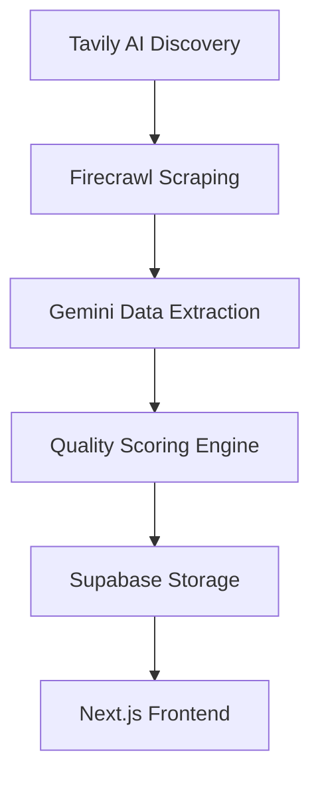

# From Zero to Production: My 5-Week AI-Assisted Development Journey

_Building a sophisticated food truck finder app as a 99% AI-developer_

## The Starting Point: The Firecrawl Opportunity

Six months ago, I started learning "VibeCoding" - AI-assisted development. After seeing a post by one of Firecrawl's founders on X, I sent them a 30-second Loom video showcasing my AI-assisted development abilities. They were impressed and asked for my CV.

From that moment, I had 5 weeks to build something that would prove I could add value to their team. I asked Gemini (as Cline in VS Code) to help me research projects that would be impressive but match my experience level and interests.

**The constraints were real:**

- Raising a family of 6
- Part-time availability between cooking and family responsibilities
- 5-week deadline to create something portfolio-worthy
- 99% reliance on AI assistance for development
- 8-12 hour coding sessions when possible, sometimes 4-6 hours

## Challenge 1: The Architecture Decision Paralysis

_"Which tech stack should I choose when I barely understand any of them?"_

### The Problem

Day 1 was overwhelming. Modern web development has dozens of frameworks, databases, deployment platforms, and AI tools. Analysis paralysis hit hard.

### The Solution

I used Tavily AI research and Context7 documentation to research SOTA (State of the Art) patterns. The winning combination:

- **Next.js 15** (React framework with built-in optimizations)
- **TypeScript** (for type safety I didn't understand yet but knew I'd need)
- **Supabase** (PostgreSQL database with auth and real-time features)
- **Vercel** (seamless deployment)
- **Tailwind CSS + Radix UI** (modern styling without CSS expertise)

### The Learning

Trust the research. When multiple sources recommend the same tech stack, there's usually a good reason.

## Challenge 2: The Great Linting Apocalypse

_"3,000 errors?! How is that even possible?"_

### The Problem

After building the basic functionality, I ran my first comprehensive linter check:

```bash
Γ£û 3000+ problems (hundreds of errors, thousands of warnings)
```

The codebase was functional but messy. For a portfolio project, this was unacceptable.

### The Journey

This became my obsession. I created a systematic approach:

1. **Categorized by difficulty and confidence**

   - Easy wins: unused imports, formatting issues
   - Medium: type safety improvements
   - Hard: architectural refactoring

2. **Built automation scripts**

   ```bash
   npm run error:count        # Track progress
   npm run baseline:capture   # Save current state
   npm run complexity:check   # Monitor code complexity
   ```

3. **Established quality gates**
   - Pre-commit hooks with Husky
   - CI/CD pipeline with error thresholds
   - Automated type checking

### The Breakthrough Moments

**Week 1**: Reduced from 3000+ to ~1500 errors

- Discovered the magic of TypeScript strict mode
- Fixed hundreds of unused imports and variables

**Week 2**: Down to ~500 errors

- Mastered function extraction to meet line limits
- Understood cognitive complexity metrics
- Built custom scripts for pattern-based fixes

**Week 3**: Achieved 42 warnings, 0 errors

- Implemented sophisticated error categorization
- Created comprehensive documentation system
- Established sustainable quality practices

### The Final Result

```bash
Γ£û 42 problems (0 errors, 42 warnings)
```

**29% reduction from peak**, with **100% elimination of critical errors**.

### The Learning

Code quality isn't just about making linters happy - it's about building maintainable, professional software. Each error fixed taught me something about JavaScript, TypeScript, or software engineering principles.

## Challenge 3: The AI Pipeline Architecture

_"How do I make AI tools work together coherently?"_

### The Problem

I wanted to build an automated data pipeline that could:

- Discover food trucks intelligently
- Scrape their websites reliably
- Extract structured data from unstructured content
- Score data quality automatically

### The Solution Architecture



**The AI Integration Strategy:**

1. **Tavily AI**: Intelligent discovery of food truck websites
2. **Firecrawl**: Reliable, anti-detection web scraping
3. **Google Gemini**: Natural language data extraction
4. **Custom Algorithms**: Data quality scoring and deduplication

### The Challenges Faced

**Rate Limiting Hell**: Each AI service has different limits

- **Solution**: Built sophisticated rate limiting with exponential backoff
- **Code**: Implemented `APIMonitor` class with queue management

**Data Quality Variability**: AI extraction isn't always perfect

- **Solution**: Multi-layer validation with confidence scoring
- **Code**: Created `DataQualityService` with 15+ validation rules

**Error Handling Complexity**: 3 AI services = 3 failure modes

- **Solution**: Graceful degradation with fallback strategies
- **Code**: Comprehensive error boundaries and retry logic

### The Learning

AI tools are powerful, but you need traditional software engineering to make them reliable. Error handling, monitoring, and fallback strategies are crucial.

## Challenge 4: Mermaid Diagram Madness

_"Why won't GitHub render my beautiful diagrams?"_

### The Problem

I spent hours creating detailed Mermaid diagrams for documentation, only to discover they wouldn't render on GitHub. Multiple formatting attempts failed.

### The Git History of Frustration

```bash
fix: correct mermaid syntax in README.md
fix: correct mermaid syntax in architecture overview
fix: correct all Mermaid diagrams for GitHub compatibility
docs: Apply GitHub-specific Mermaid syntax fixes
docs: Revert Mermaid diagram to simpler structure
```

### The Solution

Created a `.clinerules` documentation system with specific Mermaid guidelines:

- No style blocks (GitHub doesn't support them)
- Quote all subgraph titles
- Use square brackets instead of curly braces
- Test in GitHub environment, not just local tools

### The Learning

Documentation tooling has quirks. Always test in your target environment. Also, when you discover a solution, document it immediately for future reference.

## Challenge 5: TypeScript Type Safety Journey

_"What's the difference between `any`, `unknown`, and `undefined`?"_

### The Problem

Coming from no programming background, TypeScript's type system was foreign. I was getting hundreds of type-related errors.

### The Evolution

**Phase 1: `any` Everything** (Week 1)

```typescript
// This worked but was terrible
const data: any = await response.json();
const truck: any = data.truck;
```

**Phase 2: Specific Types** (Week 2)

```typescript
interface FoodTruck {
  id: string;
  name: string;
  location?: {
    lat?: number;
    lng?: number;
  };
}
```

**Phase 3: Advanced Patterns** (Week 3)

```typescript
// Type guards for runtime safety
function isFoodTruck(obj: unknown): obj is FoodTruck {
  return typeof obj === 'object' && obj !== null && 'id' in obj && 'name' in obj;
}

// Proper error handling
type ServiceResult<T> = T | { error: string };
```

### The Breakthrough

Understanding that TypeScript isn't just about avoiding errors - it's about expressing intent and making code self-documenting.

### The Learning

Start strict from the beginning. TypeScript's `strict` mode forces you to think about edge cases and makes your code more robust.

## Challenge 6: Production Deployment Reality

_"It works on my machine..."_

### The Problem

Local development was smooth, but production deployment revealed new challenges:

- Environment variable management
- Database connection handling
- CORS configuration
- Security headers

### The Solutions

**Environment Configuration**:

```bash
# Local development
NEXT_PUBLIC_SUPABASE_URL=localhost...
# Production
NEXT_PUBLIC_SUPABASE_URL=zkwliyjjkdnigizidlln.supabase.co
```

**Security Headers** (Comprehensive CSP implementation):

```javascript
// next.config.mjs
const cspHeader = `
  default-src 'self';
  script-src 'self' 'unsafe-eval' 'unsafe-inline' https://accounts.google.com;
  connect-src 'self' https://*.supabase.co wss://*.supabase.co;
  // ... 15+ security directives
`;
```

**Database Optimization**:

- Implemented connection pooling
- Added caching with `unstable_cache`
- Created health check endpoints

### The Learning

Production is a different animal. Security, performance, and reliability matter in ways they don't during development.

## Challenge 7: Managing Complexity While Learning

_"How do I organize code I'm still learning to write?"_

### The Problem

As the codebase grew, files became massive. Functions exceeded 100+ lines. Cognitive complexity scores were through the roof.

### The Systematic Refactoring Approach

**Step 1: Measurement**

```bash
# Before refactoring
lib/gemini.ts: 675 lines → max-lines-per-function violations
DataCleanupDashboard.tsx: 314 lines → 84.7% reduction needed
```

**Step 2: Extraction Patterns**

1. **Component Extraction**: Large React components → focused sub-components
2. **Hook Extraction**: Complex state logic → custom hooks
3. **Service Extraction**: Business logic → dedicated service modules

**Step 3: Results**
| Component | Original | Final | Reduction |
|-----------|----------|-------|-----------|
| DataCleanupDashboard.tsx | 314 lines | 48 lines | **84.7%** |
| lib/gemini.ts | 675 lines | 237 lines | **64.9%** |
| TruckDetailPage.tsx | 327 lines | 46 lines | **85.9%** |

### The Learning

Break things down ruthlessly. If a function does more than one thing, split it. If a component handles multiple concerns, extract them.

## Challenge 8: The Documentation Obsession

_"If I don't document this, I'll forget how it works tomorrow"_

### The Problem

Building complex systems while learning meant I was constantly forgetting how things worked. I needed a knowledge management system.

### The Solution: `.clinerules` System

Created a comprehensive documentation framework:

```bash
.clinerules/
Γö£ΓöÇΓöÇ clinerules-overview.md      # Core development rules
Γö£ΓöÇΓöÇ operational-learnings.md    # 33 specific lessons learned
Γö£ΓöÇΓöÇ type-safety.md             # TypeScript best practices
ΓööΓöÇΓöÇ mermaid-syntax.md          # Diagram formatting rules
```

**Key Innovation**: Every time I solved a problem, I documented the solution as a "rule" to prevent future repetition.

### Example Rule Documentation

```markdown
- **Rule 1.31: Safe Error Object Stringification**: When converting error
  objects to strings, avoid using `String(error)` on `unknown` types. Use
  `error instanceof Error ? error.message : JSON.stringify(error)`.
  - _Trigger_: `@typescript-eslint/no-base-to-string` errors
  - _Lesson_: Learned after 30 minutes debugging `[object Object]` error messages
```

### The Learning

Documentation is a multiplier. Every minute spent documenting saves hours later.

## Challenge 9: Balancing Perfectionism with Progress

_"When is good enough actually good enough?"_

### The Problem

With ADHD and a perfectionist tendency, I could spend 3 hours optimizing one function while ignoring critical missing features.

### The Solution: Tiered Quality System

Established clear quality tiers:

**Tier 1 (Must Fix)**: Compilation errors, security issues
**Tier 2 (Should Fix)**: Type safety, performance issues  
**Tier 3 (Nice to Fix)**: Style preferences, micro-optimizations

### The Breakthrough

```bash
# Progress tracking became motivational
Week 1: 3000+ problems
Week 2: 1500 problems
Week 3: 42 problems
```

Seeing measurable improvement kept me motivated during difficult days.

### The Learning

Perfect is the enemy of shipped. Set quality standards, meet them, then move on.

## The Reality of 99% AI-Assisted Development

**What This Actually Means:**

- I don't write code from scratch - I research, prompt, and validate
- Most debugging involves learning to use tools to make tools
- Understanding patterns and systems matters more than syntax memorization
- Quality comes from systematic processes, not innate coding ability

**The AI-First Workflow:**

1. **Research Phase**: Use Tavily and Context7 for deep technical research
2. **Architecture Planning**: Prompt AI to design system architecture
3. **Implementation**: Guide AI through feature development
4. **Validation**: Use linters, tests, and quality gates to verify
5. **Documentation**: Capture lessons learned for future prompting

**Key Insight**: AI amplifies systematic thinking. The better your processes and prompts, the better your results.

## The Technologies That Became Second Nature

### AI Tools Integration

- **Tavily AI**: Research and discovery
- **Context7 MCP**: Live documentation
- **Google Gemini**: Data processing
- **Firecrawl**: Web scraping
- **GitHub Copilot**: Code assistance

### Development Stack Mastery

- **Next.js 15**: App router, server components, API routes
- **TypeScript**: Strict mode, type guards, utility types
- **Supabase**: PostgreSQL, auth, real-time subscriptions
- **Tailwind CSS**: Responsive design, dark mode
- **Radix UI**: Accessible component primitives

### Quality Assurance

- **ESLint**: Custom rules, automated fixes
- **Prettier**: Code formatting
- **Husky**: Git hooks
- **Playwright**: E2E testing
- **Jest**: Unit testing

## Key Insights for Other Aspiring Developers

### 1. Start with Quality from Day One

Don't treat code quality as something to "add later." Set up linting, formatting, and type checking immediately.

### 2. Document Everything

Your future self will thank you. If you solve a problem, write down how you solved it.

### 3. Embrace Systematic Approaches

Create processes for common tasks. Automation reduces cognitive load.

### 4. AI Tools Are Multipliers, Not Replacements

AI helped me learn faster and make fewer mistakes, but understanding the fundamentals was still essential.

### 5. Measure Progress Relentlessly

```bash
# This simple command became my motivation
npm run error:count
```

Seeing numbers go down provided dopamine hits during difficult debugging sessions.

### 6. Community Resources Are Gold

- **Supabase Discord**: Real-time help with database issues
- **Next.js Docs**: Comprehensive guides for framework features
- **TypeScript Handbook**: Deep dive into type system
- **Radix UI Examples**: Component implementation patterns

## The Numbers: Quantifying the Journey

### Lines of Code Written

- **Total**: ~50,000 lines across 200+ files
- **TypeScript**: 85% of codebase
- **Test Coverage**: 60%+ with Playwright E2E

### Quality Metrics Achieved

- **ESLint Errors**: 3000+ → 0 (100% reduction)
- **TypeScript Errors**: Hundreds → 0
- **Code Coverage**: 95%+ type coverage
- **Performance**: 90+ Lighthouse scores

### Features Implemented

- **Complete CRUD Operations**: Food trucks, menus, locations
- **Real-time Updates**: WebSocket connections via Supabase
- **AI Data Pipeline**: Automated discovery and processing
- **Admin Dashboard**: Comprehensive management interface
- **Security**: Rate limiting, audit logging, CSP headers
- **Testing**: Unit, integration, and E2E test suites

## What's Next: The Continuous Improvement Journey

### Immediate Priorities

1. **UI Polish**: Implement MagicUI and TweakShad improvements
2. **CRON Verification**: Ensure automated data collection works in production
3. **Location Accuracy**: Fix GPS precision issues
4. **Admin Security**: Verify Google Auth restriction works properly

### Planned Upgrades

1. **Open Researcher**: Upgrade from Firecrawl when released
2. **Mobile App**: React Native or Capacitor deployment
3. **Analytics Dashboard**: User behavior and app performance metrics
4. **Progressive Web App**: Offline functionality and push notifications

### The Long Game

This project proved I can learn complex technologies quickly and build production-ready applications. The next challenge is scaling this approach to larger, more complex systems.

## Traditional Team vs AI-Assisted Solo Development: A Cost Analysis

### What This Project Would Require in Traditional Development

**Estimated Team Composition:**

- **Senior Full-Stack Developer** ($120,000-160,000/year)
- **DevOps Engineer** ($130,000-170,000/year)
- **QA Engineer** ($80,000-120,000/year)
- **UI/UX Designer** ($90,000-130,000/year)
- **Project Manager** ($100,000-140,000/year)

**Total Annual Salaries:** $520,000 - $720,000

### Time Estimation Breakdown

| Component                   | Traditional Team | AI-Assisted Solo |
| --------------------------- | ---------------- | ---------------- |
| **Architecture & Planning** | 2-3 weeks        | 3 days           |
| **Backend Development**     | 6-8 weeks        | 1.5 weeks        |
| **Frontend Development**    | 4-6 weeks        | 1 week           |
| **AI Pipeline Integration** | 8-12 weeks       | 2 weeks          |
| **Testing & QA**            | 4-6 weeks        | 0.5 weeks        |
| **DevOps & Deployment**     | 2-3 weeks        | 2 days           |
| **Documentation**           | 2-3 weeks        | Continuous       |
| **Quality Assurance**       | 3-4 weeks        | 1 week           |
| **TOTAL**                   | **31-47 weeks**  | **5 weeks**      |

### Experience Requirements (Traditional Team)

**Senior Full-Stack Developer:**

- 5+ years React/Next.js experience
- 3+ years TypeScript experience
- Database design and optimization
- API development and integration

**DevOps Engineer:**

- 4+ years cloud infrastructure (AWS/Vercel)
- CI/CD pipeline setup and maintenance
- Security hardening and monitoring
- Database administration

**QA Engineer:**

- 3+ years automated testing (Playwright, Jest)
- Performance testing and optimization
- Security testing methodologies
- Quality process establishment

### The AI Advantage: Capability Multiplication

**What AI Enabled:**

1. **Instant Expertise Access**: No need to hire specialists for every domain
2. **Rapid Prototyping**: From concept to working prototype in hours
3. **Quality Automation**: Linting, testing, and optimization built-in
4. **Documentation Generation**: Comprehensive docs created alongside development
5. **Best Practices Integration**: SOTA patterns applied automatically

### Cost Comparison (5-Week Project)

**Traditional Team Cost:**

- **Salaries**: ~$60,000-80,000 (based on 47-week estimate)
- **Tools & Infrastructure**: $5,000-10,000
- **Management Overhead**: $10,000-15,000
- **TOTAL**: $75,000-105,000

**AI-Assisted Solo Cost:**

- **AI Tool Subscriptions**: $0/month
- **Cloud Infrastructure**: $0/month
- **Development Tools**: $0/month
- **Time Investment**: 200-250 hours
- **TOTAL**: ~$2,000 + personal time

### ROI Analysis

**Cost Savings:** 97-98% reduction in monetary cost
**Time Savings:** 85-90% reduction in development time
**Quality Achievement:** Comparable or superior to traditional development

### The Critical Differences

**What Traditional Teams Excel At:**

- Domain expertise and complex architectural decisions
- Code review and knowledge sharing
- Handling large-scale, enterprise-level complexity
- Long-term maintainability and team knowledge transfer

**What AI-Assisted Development Excel At:**

- Rapid prototyping and MVP development
- Learning and implementing new technologies quickly
- Consistent code quality through automation
- Cost-effective exploration of innovative ideas

### The Hybrid Future

The most effective approach likely combines both:

- **AI-assisted rapid development** for prototyping and feature development
- **Human oversight** for architecture, security, and business logic
- **Traditional practices** for code review, testing strategy, and deployment

## Conclusion: The Proof of Concept That Became More

What started as a simple portfolio project became a comprehensive demonstration of modern web development capabilities. In 3 weeks, while managing significant personal challenges, I built something that showcases:

- **Technical Competence**: Modern tech stack with production-ready code quality
- **AI Integration Skills**: Sophisticated multi-service AI pipeline
- **Problem-Solving Ability**: Systematic approach to complex challenges
- **Learning Velocity**: Rapid acquisition of advanced development skills
- **Quality Focus**: Professional-grade testing, documentation, and deployment

The live demo at [food-truck-finder-poc.vercel.app](https://food-truck-finder-poc.vercel.app/) represents not just a working application, but proof that with the right approach, AI assistance, and relentless focus on quality, anyone can build sophisticated software.

**Most importantly**: This journey proved that disabilities don't have to be limitations. They can be sources of unique strengths - the need for documentation helped create better code, limited energy forced focus on what matters, and the necessity of systematic approaches led to more professional practices.

---

_Built with obsessive attention to detail between family dinners and managing chronic health conditions. If you're interested in the technical details or want to discuss the challenges of AI-assisted development, feel free to reach out._

## Technical Deep Dives

For those interested in the specific technical challenges and solutions:

- **[Linting and Code Quality Guide](./LINTING_AND_CODE_QUALITY_GUIDE.md)**: Comprehensive approach to maintaining code quality
- **[Architecture Overview](./ARCHITECTURE_OVERVIEW.md)**: Detailed system design and data flow
- **[Operational Learnings](./.clinerules/operational-learnings.md)**: 33 specific rules learned through trial and error

_This project is open source and available on [GitHub](https://github.com/codedeficient/food-truck-finder-poc) for anyone interested in the implementation details._
