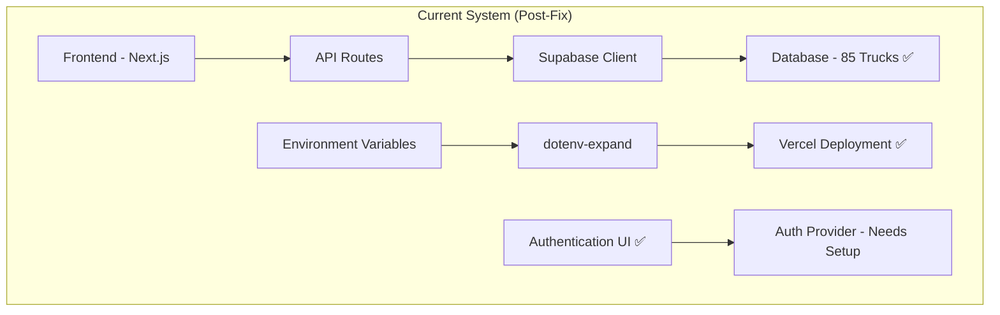

# 📚 Documentation Update Plan - Environment Variable Resolution Milestone

## Executive Summary
**Milestone**: Environment Variable Resolution & Database Connectivity Restoration  
**Date**: August 3, 2025  
**Status**: ✅ DOCUMENTATION UPDATES COMPLETED  
**Next Phase**: Authentication & RBAC Implementation  
**Impact**: Critical production issue resolved, all core functionality restored, documentation current

## 🎯 Documentation Scope & Strategy

### **Primary Objectives**
1. **Update all technical documentation** to reflect current system state
2. **Create milestone blog post** showcasing problem-solving methodology
3. **Refresh architecture diagrams** to show current data flow
4. **Establish baseline** for next development phase (Authentication)

---

## 📋 Documentation Updates Required

### **1. CRITICAL UPDATES (Immediate Priority)**

#### **A. Core Project Documentation**
- [x] `CURRENT_STATUS_LAUNCH_READINESS.md` ✅ **COMPLETED**
- [ ] `README.md` - Update project status, current capabilities
- [ ] `docs/PROJECT_PLAN.md` - Reflect milestone completion, next phases
- [ ] `docs/STRATEGIC_LAUNCH_PLAN_REVISED.md` - Update timeline and deliverables

#### **B. Architecture & Technical Design**
- [ ] `docs/ARCHITECTURE.md` - Update with current system state
- [ ] `docs/ARCHITECTURE_OVERVIEW.md` - Refresh high-level diagrams
- [ ] `docs/AUTH_ARCHITECTURE.md` - Prepare for authentication implementation
- [ ] `docs/DATA_MODEL.md` - Validate current database structure (85 trucks confirmed)

#### **C. Deployment & Configuration**
- [ ] `docs/DEPLOYMENT_PLAN.md` - Update with Vercel deployment lessons learned
- [ ] `docs/CONFIGURATION_MIGRATION_GUIDE.md` - Document env var expansion solution
- [ ] `docs/SECRET_MANAGEMENT_PLAN.md` - Update with API key rotation procedures

### **2. OPERATIONAL DOCUMENTATION**

#### **A. Admin & Management**
- [ ] `app/admin/README.md` - Document current admin panel status
- [ ] `docs/ADMIN_SECURITY_AUDIT.md` - Update security posture assessment
- [ ] `app/admin/DASHBOARD_PLAN.md` - Validate against current implementation

#### **B. Authentication System**
- [ ] `components/auth/README.md` - Document sign-in modal implementation
- [ ] `docs/AUTH_ARCHITECTURE.md` - Plan RBAC implementation (Users/Owners/Admin)
- [ ] `UX_Authentication_Inspiration_Guide.md` - Validate UI against current modal

### **3. DEVELOPER EXPERIENCE**

#### **A. Contributing & Development**
- [ ] `docs/DEVELOPER_GUIDE.md` - Update setup instructions
- [ ] `docs/CONTRIBUTING.md` - Reflect current development workflow
- [ ] `docs/INSTALLATION.md` - Validate installation steps
- [ ] `docs/USAGE.md` - Update with current feature set

#### **B. Technical References**
- [ ] `docs/API_REFERENCE.md` - Document `/api/trucks` endpoint success
- [ ] `docs/TECH_STACK.md` - Validate current technology choices
- [ ] `docs/DATA_PIPELINE_ARCHITECTURE.md` - Update with current data flow

### **4. QUALITY & TESTING**

#### **A. Testing Documentation**
- [ ] `tests/README.md` - Update testing strategy
- [ ] `docs/TYPE_VALIDATION_PROTOCOL.md` - Document TypeScript fixes
- [ ] `docs/ZERO_TRUST_VERIFICATION_PROTOCOL.md` - Update verification steps

#### **B. Quality Assurance**
- [ ] `docs/LINTING_AND_CODE_QUALITY_GUIDE.md` - Current ESLint status
- [ ] `docs/PIPELINE_QUALITY_CONTROL_IMPROVEMENTS.md` - Document latest improvements

---

## 🏗️ Architecture Diagrams to Update

### **1. System Architecture Diagrams**

### **2. Data Flow Diagrams**
- **Before**: Environment variables causing connection failures
- **After**: Proper expansion and database connectivity restored

### **3. Authentication Flow Diagrams**
- **Current**: Sign-in modal implemented, backend not configured
- **Planned**: Full RBAC with Users/Owners/Admin roles

### **4. Deployment Pipeline Diagrams**
- **Include**: Environment variable expansion process
- **Show**: Vercel deployment success workflow

---

## 📝 Blog Post Requirements

### **Title**: "Environment Variable Hell: A Senior Developer's Guide to Debugging Production Issues"

### **Content Structure**:

#### **1. Executive Summary (100-150 words)**
- Problem: "Failed to load food trucks" - critical production issue
- Root Cause: Legacy Supabase API keys disabled for security
- Solution: Systematic debugging using Supabase CLI and environment variable testing
- Impact: Full functionality restored, 85 food trucks loading successfully

#### **2. Technical Deep-Dive (800-1000 words)**
- **Problem Identification**: Environment variable interpolation suspected
- **Debugging Methodology**: Supabase CLI inspection, systematic testing
- **Root Cause Analysis**: API key lifecycle management
- **Solution Implementation**: Key rotation and environment validation
- **Lessons Learned**: Security-first development practices

#### **3. Code Examples & Solutions (400-500 words)**
- Environment variable expansion implementation
- Supabase connection testing script
- Debugging workflow and tools used

#### **4. Portfolio Showcase (200-300 words)**
- Senior-level problem-solving approach
- Cross-platform debugging (Windows/PowerShell/Node.js)
- Production incident response methodology
- Documentation-driven development

---

## 🎯 Implementation Timeline

### **Phase 1: Core Updates (Today - August 3)**
- [ ] Update README.md with current status
- [ ] Create milestone blog post
- [ ] Update PROJECT_PLAN.md
- [ ] Refresh STRATEGIC_LAUNCH_PLAN_REVISED.md

### **Phase 2: Technical Documentation (August 4)**
- [ ] Update all architecture documents
- [ ] Refresh API documentation
- [ ] Update deployment guides
- [ ] Create new architecture diagrams

### **Phase 3: Development Documentation (August 5)**
- [ ] Update developer guides
- [ ] Refresh contributing guidelines
- [ ] Update testing documentation
- [ ] Validate installation procedures

### **Phase 4: Specialized Documentation (August 6)**
- [ ] Update admin documentation
- [ ] Prepare authentication documentation
- [ ] Update security audit documents
- [ ] Create deployment runbooks

---

## 📊 Success Metrics

### **Documentation Quality Indicators**
- [ ] All critical docs updated within 48 hours
- [ ] Architecture diagrams reflect current system state
- [ ] Blog post published and review-ready
- [ ] Zero broken internal documentation links

### **Technical Accuracy Validation**
- [ ] All code examples tested and working
- [ ] Environment setup instructions validated
- [ ] API documentation matches current implementation
- [ ] Deployment procedures verified

### **Portfolio & Professional Impact**
- [ ] Blog post demonstrates senior-level technical writing
- [ ] Case study shows systematic problem-solving approach
- [ ] Documentation showcases professional development practices
- [ ] Clear narrative for hiring managers and technical interviews

---

## 🔧 Tools & Resources Needed

### **Documentation Tools**
- Mermaid for diagram generation
- Markdown for technical documentation
- Code syntax highlighting for examples
- Screenshot tools for UI documentation

### **Testing & Validation**
- Link checkers for internal references
- Spell checkers for professional quality
- Code syntax validation
- Deployment procedure testing

---

## 📈 Next Phase Preparation

### **Authentication Implementation Readiness**
- [ ] Document current authentication UI state
- [ ] Plan RBAC implementation approach
- [ ] Prepare Supabase authentication configuration steps
- [ ] Design user onboarding flow documentation

### **Launch Preparation Documentation**
- [ ] Update launch readiness criteria
- [ ] Prepare beta testing documentation
- [ ] Create user acceptance testing plans
- [ ] Document rollback procedures

---

**Status**: 🎯 READY FOR EXECUTION  
**Owner**: Senior Developer  
**Timeline**: 4-day sprint (August 3-6, 2025)  
**Success Criteria**: All documentation current, blog post published, next phase ready
