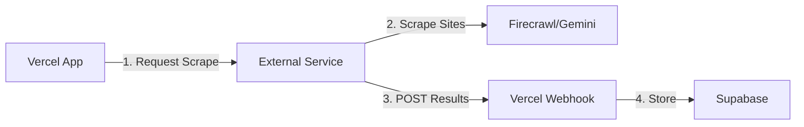

# Alternative Scraping Architectures

## Current Limitations (Vercel Hobby)
- 10-second timeout per function
- 1 CRON job execution per day
- No background workers

## Alternative Approaches

### 1. **GitHub Actions as CRON Alternative** ✅ RECOMMENDED
Free tier includes:
- 2,000 minutes/month (66 minutes/day)
- Can run every 5 minutes
- 6-hour max job duration

**Implementation:**
```yaml
# .github/workflows/scrape-trucks.yml
name: Scrape Food Trucks
on:
  schedule:
    - cron: '*/30 * * * *'  # Every 30 minutes
  workflow_dispatch:  # Manual trigger

jobs:
  scrape:
    runs-on: ubuntu-latest
    steps:
      - uses: actions/checkout@v4
      - uses: actions/setup-node@v4
      - run: npm ci
      - run: node scripts/scrape-trucks.js
        env:
          SUPABASE_URL: ${{ secrets.SUPABASE_URL }}
          SUPABASE_SERVICE_ROLE_KEY: ${{ secrets.SUPABASE_SERVICE_ROLE_KEY }}
```

### 2. **Cloudflare Workers**
- 100,000 requests/day free
- 10ms CPU time (burst to 50ms)
- Built-in CRON triggers
- Can chain multiple workers

```javascript
// Cloudflare Worker with D1 database
export default {
  async scheduled(controller, env, ctx) {
    // Create scraping jobs
    const jobs = await createScrapingJobs(env.DB);
    
    // Process in chunks
    for (const job of jobs) {
      // Each job gets its own worker invocation
      await env.QUEUE.send(job);
    }
  },
};
```

### 3. **Client-Side Progressive Scraping**
Use the browser to do the heavy lifting:

```typescript
// Admin dashboard component
const AdminScraper = () => {
  const [progress, setProgress] = useState(0);
  
  const runScraping = async () => {
    const urls = await getUrlsToScrape();
    
    for (const [index, url] of urls.entries()) {
      // Process one at a time
      await fetch('/api/scrape-single', {
        method: 'POST',
        body: JSON.stringify({ url })
      });
      
      setProgress((index + 1) / urls.length * 100);
      
      // Pause between requests
      await new Promise(r => setTimeout(r, 2000));
    }
  };
  
  return (
    <div>
      <button onClick={runScraping}>Start Manual Scraping</button>
      <progress value={progress} max="100" />
    </div>
  );
};
```

### 4. **Hybrid Approach: External Service + Webhooks**
Use a dedicated scraping service that posts back to your API:



**Options:**
- **Railway.app**: $5/month, no timeout limits
- **Render.com**: Free tier with 750 hours
- **Fly.io**: Free tier with 3 shared VMs
- **AWS Lambda**: 1M requests free/month

### 5. **Supabase Edge Functions**
Since you're already using Supabase:

```typescript
// supabase/functions/scrape-trucks/index.ts
import { serve } from "https://deno.land/std@0.168.0/http/server.ts"

serve(async (req) => {
  // This runs on Supabase's infrastructure
  // No Vercel timeouts!
  const jobs = await getScrapingJobs();
  
  for (const job of jobs) {
    await processJob(job);
  }
  
  return new Response(JSON.stringify({ success: true }));
});
```

### 6. **Local Development Server**
For development/testing, run a local Node.js server:

```typescript
// scripts/local-scraper-server.js
import express from 'express';
import { CronJob } from 'cron';

const app = express();

// Run every 30 minutes
new CronJob('*/30 * * * *', async () => {
  console.log('Running local scraping job...');
  await runFullScraping();
}, null, true);

app.listen(3001, () => {
  console.log('Local scraper running on port 3001');
});
```

## Recommended Architecture

### For Production:
1. **GitHub Actions** for scheduled scraping (reliable, free)
2. **Vercel** for the web app (great DX, fast)
3. **Supabase** for data storage
4. **Manual trigger** in admin panel for on-demand scraping

### For Development:
1. **Local Node.js server** with real CRON
2. **Admin dashboard** with progress tracking
3. **Chunked processing** to test incrementally

## Implementation Plan

### Phase 1: Local Testing
```bash
# Create local scraper
node scripts/local-scraper-server.js

# Test chunked processing
npm run test:scraping
```

### Phase 2: GitHub Actions Setup
1. Create `.github/workflows/scrape.yml`
2. Add repository secrets
3. Test with manual dispatch
4. Enable scheduled runs

### Phase 3: Admin Dashboard
1. Add scraping status page
2. Show job queue
3. Manual trigger button
4. Progress indicators

### Phase 4: Monitoring
1. Set up error notifications
2. Track success rates
3. Monitor data quality

## Cost Comparison

| Solution | Cost | Pros | Cons |
|----------|------|------|------|
| Vercel Hobby | Free | Easy deploy | 10s timeout, 1/day CRON |
| Vercel Pro | $20/mo | 5min timeout | Still limited |
| GitHub Actions | Free | 6hr timeout, frequent runs | Separate from app |
| Cloudflare | Free | Fast, global | 50ms CPU limit |
| Railway | $5/mo | No limits | Additional service |
| Self-hosted | ~$5/mo | Full control | Maintenance |

## Decision Matrix

**For your use case, I recommend:**
1. **GitHub Actions** for reliable scheduled scraping
2. **Keep Vercel** for the web app
3. **Add manual triggers** in admin panel
4. **Use local server** for development

This gives you:
- ✅ Reliable scraping every 30 minutes
- ✅ No timeout issues  
- ✅ Free (within GitHub limits)
- ✅ Easy to monitor and debug
- ✅ Can run heavy processing
