# Zero Trust Post-Action Verification Protocol

## 🔒 **PROTOCOL OVERVIEW**

The Zero Trust Post-Action Verification Protocol is a comprehensive validation framework that ensures **every code change maintains system integrity** through systematic verification checkpoints.

**Core Principle**: *"Never trust, always verify"* - Every change must pass all verification gates before being considered successful.

---

## 🏗️ **VERIFICATION ARCHITECTURE**

```mermaid
flowchart TD
    A[Code Change Made] --> B{Pre-Verification}
    B -->|✅ Pass| C[Execute Change]
    B -->|❌ Fail| A1[Abort Operation]
    
    C --> D[Post-Action Verification Battery]
    
    D --> E[Stage 1: TypeScript Compilation]
    E -->|✅ Pass| F[Stage 2: ESLint Analysis]
    E -->|❌ Fail| R1[Rollback + Analysis]
    
    F -->|✅ Pass| G[Stage 3: Build Verification]
    F -->|❌ Fail| R2[Rollback + Analysis]
    
    G -->|✅ Pass| H[Stage 4: Import Resolution]
    G -->|❌ Fail| R3[Rollback + Analysis]
    
    H -->|✅ Pass| I[Stage 5: Runtime Checks]
    H -->|❌ Fail| R4[Rollback + Analysis]
    
    I -->|✅ Pass| J[Stage 6: Performance Validation]
    I -->|❌ Fail| R5[Rollback + Analysis]
    
    J -->|✅ Pass| K[✅ VERIFICATION COMPLETE]
    J -->|❌ Fail| R6[Rollback + Analysis]
    
    K --> L[Git Commit + Documentation]
    
    subgraph "Rollback Procedures"
        R1 --> RB1[Immediate Rollback]
        R2 --> RB2[Immediate Rollback]
        R3 --> RB3[Immediate Rollback]
        R4 --> RB4[Immediate Rollback]
        R5 --> RB5[Immediate Rollback]
        R6 --> RB6[Immediate Rollback]
        
        RB1 --> RA[Root Cause Analysis]
        RB2 --> RA
        RB3 --> RA
        RB4 --> RA
        RB5 --> RA
        RB6 --> RA
        
        RA --> FX[Alternative Fix Strategy]
        FX --> A
    end
    
    subgraph "Verification Stages"
        E
        F
        G
        H
        I
        J
    end
    
    style K fill:#4CAF50,stroke:#2E7D32,stroke-width:3px
    style A1 fill:#F44336,stroke:#C62828,stroke-width:2px
    style RA fill:#FF9800,stroke:#F57C00,stroke-width:2px
```



---

## 📋 **VERIFICATION STAGES**

### **Stage 1: TypeScript Compilation** 🔧
```bash
npx tsc --noEmit
```
**Purpose**: Ensure type safety and catch compilation errors  
**Success Criteria**: Zero TypeScript errors  
**Failure Action**: Immediate rollback, analyze type conflicts

### **Stage 2: ESLint Analysis** 🔍
```bash
npx eslint [changed-files] --quiet
```
**Purpose**: Verify code quality and prevent regressions  
**Success Criteria**: No increase in error count  
**Failure Action**: Rollback, fix linting issues

### **Stage 3: Build Verification** 🏗️
```bash
npm run build
```
**Purpose**: Ensure production build succeeds  
**Success Criteria**: Successful build completion  
**Failure Action**: Rollback, analyze build failures

### **Stage 4: Import Resolution** 📦
```bash
# Verify all imports resolve correctly
node -e "require('./dist/index.js')"
```
**Purpose**: Catch broken imports and module resolution  
**Success Criteria**: All imports resolve without errors  
**Failure Action**: Rollback, fix import paths

### **Stage 5: Runtime Checks** ⚡
```bash
# Test critical paths
npm run test:critical
```
**Purpose**: Verify core functionality works  
**Success Criteria**: All critical tests pass  
**Failure Action**: Rollback, analyze runtime failures

### **Stage 6: Performance Validation** 📊
```bash
# Performance regression check
npm run perf:check
```
**Purpose**: Ensure no performance regressions  
**Success Criteria**: Performance within acceptable bounds  
**Failure Action**: Rollback, optimize performance

---

## 🔄 **IMPLEMENTATION EXAMPLES**

### **Example 1: Component Fix** 
```bash
# 1. Make change to AdminNavLinks.tsx
# 2. Run verification protocol:

npx tsc --noEmit                           # Stage 1 ✅
npx eslint components/admin/AdminNavLinks.tsx --quiet # Stage 2 ✅
npm run build                              # Stage 3 ✅
# Import resolution verified automatically  # Stage 4 ✅
npm run test:components                    # Stage 5 ✅
npm run lighthouse:ci                      # Stage 6 ✅

# 3. All stages pass → Commit change
git add components/admin/AdminNavLinks.tsx
git commit -m "fix: unsafe icon assignments in AdminNavLinks"
```

### **Example 2: ESLint Error Fix**
```bash
# 1. Fix unsafe assignment in TruckContactInfo.tsx
# 2. Run verification:

npx tsc --noEmit                           # Stage 1 ✅
npx eslint components/trucks/TruckContactInfo.tsx --quiet # Stage 2 ✅
npm run build                              # Stage 3 ✅
# ... continue through all stages

# 3. All stages pass → Success
```

### **Example 3: Failed Verification**
```bash
# 1. Make change that breaks TypeScript
# 2. Run verification:

npx tsc --noEmit                           # Stage 1 ❌ FAIL
# → Immediate rollback triggered
git checkout -- [modified-files]
npx tsc --noEmit                           # Verify clean state ✅
# → Analyze error and try alternative approach
```

---

## 🚨 **ROLLBACK PROCEDURES**

### **Immediate Rollback Protocol**
1. **Stop all work immediately**
2. **Execute rollback command**: `git checkout -- [affected-files]`
3. **Verify clean state**: Re-run failed verification stage
4. **Document failure**: Log what went wrong and why

### **Root Cause Analysis**
1. **Identify failure point**: Which stage failed and why
2. **Analyze error messages**: Extract actionable information
3. **Review change impact**: Understand broader implications
4. **Plan alternative approach**: Different strategy to achieve goal

### **Alternative Fix Strategy**
1. **Smaller increments**: Break change into smaller pieces
2. **Different approach**: Use alternative implementation
3. **Staged rollout**: Implement change in phases
4. **Consultation**: Get input from team/documentation

---

## 📊 **PROTOCOL METRICS**

### **Success Metrics**
- **Verification Pass Rate**: >95% of changes pass all stages
- **Rollback Rate**: <5% of changes require rollback
- **Clean State Maintenance**: 100% TypeScript compilation success
- **Build Stability**: 100% successful builds after verification

### **Performance Metrics**
- **Verification Time**: <2 minutes per change
- **Rollback Time**: <30 seconds to clean state
- **Fix Success Rate**: >90% of alternative approaches succeed

---

## 🎯 **PROTOCOL BENEFITS**

### **Risk Mitigation**
- **Prevents production breaks**: Catches issues before deployment
- **Maintains clean codebase**: Ensures consistent quality
- **Reduces debugging time**: Issues caught early are easier to fix
- **Protects team velocity**: Prevents blocking merge conflicts

### **Quality Assurance**
- **Type safety guarantee**: Zero TypeScript errors always
- **Code quality maintenance**: ESLint standards enforced
- **Build stability**: Production builds always succeed
- **Performance protection**: No accidental regressions

### **Developer Experience**
- **Clear feedback**: Immediate validation results
- **Guided recovery**: Structured rollback procedures
- **Learning opportunity**: Understanding why changes fail
- **Confidence building**: Trust in change safety

---

## 🏆 **ENTERPRISE STANDARDS**

This protocol aligns with industry best practices:

- **Netflix**: "Zero trust in production deployments"
- **Google**: "Continuous verification at every stage"
- **Microsoft**: "Fail-fast with immediate recovery"
- **Amazon**: "Automated quality gates with human oversight"

**Implementation Status**: ✅ **ACTIVE** - Applied to all critical code changes

---

## 🔧 **AUTOMATION OPPORTUNITIES**

### **Future Enhancements**
- **Pre-commit hooks**: Automatic verification before commits
- **CI/CD integration**: Verification in deployment pipeline
- **Slack notifications**: Real-time verification results
- **Metrics dashboard**: Visual verification success tracking

**The Zero Trust Protocol ensures that every change maintains the professional quality standards expected in enterprise-grade applications.**
