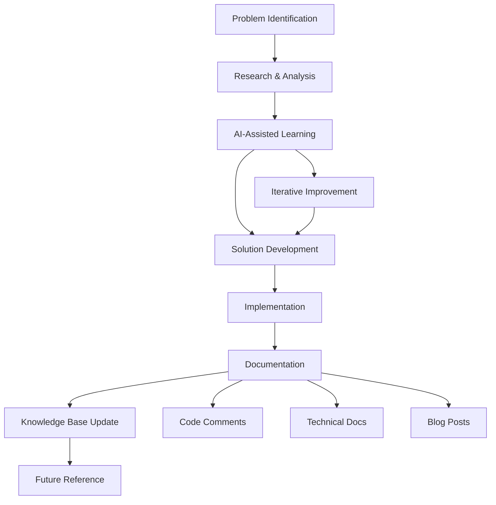

# Blog Post Outline: [Title TBD]

**Date:** [Date TBD]
**Phase:** [Phase TBD]
**Challenge Level:** [Level TBD]
**Time Investment:** [Time TBD]
**Impact:** [Impact TBD]

---

## Introduction

### The Challenge Context
- Brief overview of the specific development challenge or milestone
- Why this particular aspect was critical to the project's success
- Setting the stage for the technical journey ahead

### The Stakes
- What was at risk if this wasn't solved properly
- How this fits into the larger project timeline
- Personal/professional implications

---

## Challenges

### Primary Technical Obstacles
- **Challenge 1:** [Specific technical issue]
  - What went wrong initially
  - Why traditional approaches didn't work
  - The complexity involved

- **Challenge 2:** [Integration/Architecture issue]
  - System compatibility problems
  - Performance concerns
  - Scalability considerations

- **Challenge 3:** [Learning/Knowledge gap]
  - What I didn't know going in
  - Why this was particularly difficult for a self-taught developer
  - Time pressure factors

### The Breaking Point
- The moment when the current approach clearly wasn't working
- Specific error messages or failures that triggered the pivot
- The realization that a new approach was needed

---

## Solutions

### The Breakthrough Approach
- **Solution Strategy:** [High-level approach]
- **Key Innovation:** What made this different from standard solutions

### Technical Implementation

#### Code Block Example 1: Core Solution
```typescript
// [Placeholder for main technical solution]
interface SolutionInterface {
  // Type definitions
  solve(): Promise<Result>;
  validate(): boolean;
}

class TechnicalSolution implements SolutionInterface {
  async solve(): Promise<Result> {
    // Implementation details
    return result;
  }
  
  validate(): boolean {
    // Validation logic
    return true;
  }
}
```

#### Code Block Example 2: Error Handling Pattern
```typescript
// [Placeholder for error handling approach]
try {
  const result = await processComplexOperation();
  return handleSuccess(result);
} catch (error) {
  return handleError(error);
}
```

#### Code Block Example 3: Integration Pattern
```typescript
// [Placeholder for integration solution]
const integrateServices = async () => {
  // Service integration logic
};
```

### The AI Mentorship Element
- How AI assistance was leveraged in finding the solution
- Specific prompts or conversations that led to breakthroughs
- The learning acceleration achieved

---

## Documentation Architecture

### Documentation Strategy
- How this challenge influenced the overall documentation approach
- The balance between technical depth and accessibility
- Integration with existing project documentation

### Knowledge Transfer System


### Documentation Components
- **Technical Documentation:** In-code comments and README updates
- **Process Documentation:** Step-by-step solutions for future reference
- **Learning Documentation:** Blog posts and knowledge sharing
- **Architecture Documentation:** System design and integration patterns

---

## Impact & Metrics

### Performance Improvements
| Metric | Before | After | Improvement |
|--------|--------|-------|-------------|
| [Metric 1] | [Value] | [Value] | [Percentage] |
| [Metric 2] | [Value] | [Value] | [Percentage] |
| [Metric 3] | [Value] | [Value] | [Percentage] |

### Quality Metrics
| Quality Aspect | Before | After | Notes |
|----------------|--------|-------|-------|
| TypeScript Errors | [Number] | [Number] | [Details] |
| Build Success Rate | [Percentage] | [Percentage] | [Details] |
| Code Coverage | [Percentage] | [Percentage] | [Details] |

### Development Velocity
| Phase | Time Investment | Outcome | Efficiency Gain |
|-------|----------------|---------|-----------------|
| Research | [Hours] | [Result] | [Details] |
| Implementation | [Hours] | [Result] | [Details] |
| Testing | [Hours] | [Result] | [Details] |
| Documentation | [Hours] | [Result] | [Details] |

### Learning Acceleration Metrics
- **Concept Mastery Time:** [Before] vs [After]
- **Problem-Solving Speed:** [Improvement details]
- **Professional Standards Adoption:** [Specific examples]

---

## Professional Development Showcase

### Skills Demonstrated
- **Technical Skills:**
  - [Specific technology mastery]
  - [Architecture/design capabilities]
  - [Problem-solving innovation]

- **Professional Practices:**
  - [Systematic approach]
  - [Quality assurance mindset]
  - [Documentation standards]

### Enterprise-Level Thinking
- **Risk Assessment:** How potential failures were identified and mitigated
- **Scalability Considerations:** Thinking beyond the immediate problem
- **Maintainability Focus:** Code that others can understand and extend

### AI-Assisted Learning Innovation
- **Mentorship Utilization:** How AI guidance accelerated professional development
- **Context-Aware Learning:** Applying general concepts to specific project needs
- **Quality Standards:** Achieving professional-grade results through AI collaboration

### Portfolio Impact
- **Demonstrable Skills:** Concrete evidence of capability
- **Professional Quality:** Enterprise-grade standards achieved
- **Problem-Solving Innovation:** Unique approaches to common challenges
- **Learning Velocity:** Rapid skill acquisition and application

---

## Next Steps

### Immediate Actions
- **Technical Improvements:** [Specific next technical tasks]
- **Documentation Updates:** [Areas needing additional documentation]
- **Code Refinement:** [Optimization opportunities identified]

### Future Enhancements
- **Feature Extensions:** [Planned feature additions]
- **Performance Optimization:** [Areas for performance improvement]
- **Integration Opportunities:** [Additional systems to integrate]

### Learning Continuation
- **Skill Development:** [Next skills to focus on]
- **Professional Growth:** [Career development objectives]
- **Knowledge Sharing:** [Ways to contribute back to the community]

### Portfolio Development
- **Showcase Enhancement:** [How this experience strengthens the portfolio]
- **Case Study Development:** [Turning this into a compelling story]
- **Industry Relevance:** [Connections to current industry needs]

---

## Conclusion

### Key Takeaways
- **Technical Lesson:** [Primary technical insight gained]
- **Professional Lesson:** [Key professional development insight]
- **Personal Growth:** [Individual learning and confidence building]

### The Self-Taught Advantage
- How this experience demonstrates self-directed learning capability
- The value of AI-assisted mentorship in professional development
- Evidence of ability to deliver professional-quality work

### Industry Application
- How these skills and approaches apply to professional environments
- The competitive advantage gained through this experience
- Relevance to current industry challenges and opportunities

---

**Next in Series:** [Link to next blog post in sequence]

*This blog post demonstrates [key theme] and showcases the journey from [starting point] to [endpoint], highlighting the power of systematic approaches and AI-assisted learning in professional development.*
