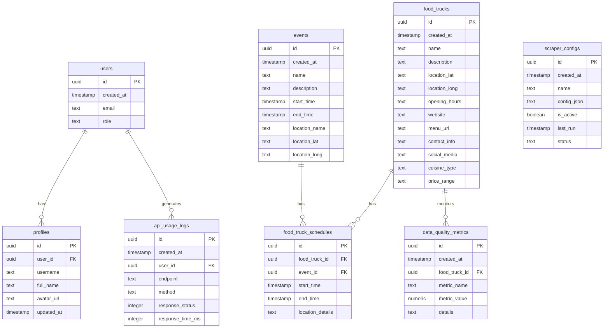

# Database Schema Diagram

```mermaid
erDiagram
    users {
        uuid id PK
        timestamp created_at
        text email
        text role
    }

    profiles {
        uuid id PK
        uuid user_id FK
        text username
        text full_name
        text avatar_url
        timestamp updated_at
    }

    food_trucks {
        uuid id PK
        timestamp created_at
        text name
        text description
        text location_lat
        text location_long
        text opening_hours
        text website
        text menu_url
        text contact_info
        text social_media
        text cuisine_type
        text price_range
    }

    events {
        uuid id PK
        timestamp created_at
        text name
        text description
        timestamp start_time
        timestamp end_time
        text location_name
        text location_lat
        text location_long
    }

    food_truck_schedules {
        uuid id PK
        uuid food_truck_id FK
        uuid event_id FK
        timestamp start_time
        timestamp end_time
        text location_details
    }

    scraper_configs {
        uuid id PK
        timestamp created_at
        text name
        text config_json
        boolean is_active
        timestamp last_run
        text status
    }

    api_usage_logs {
        uuid id PK
        timestamp created_at
        uuid user_id FK
        text endpoint
        text method
        integer response_status
        integer response_time_ms
    }

    data_quality_metrics {
        uuid id PK
        timestamp created_at
        uuid food_truck_id FK
        text metric_name
        numeric metric_value
        text details
    }

    users ||--o{ profiles : "has"
    food_trucks ||--o{ food_truck_schedules : "has"
    events ||--o{ food_truck_schedules : "has"
    users ||--o{ api_usage_logs : "generates"
    food_trucks ||--o{ data_quality_metrics : "monitors"
```
