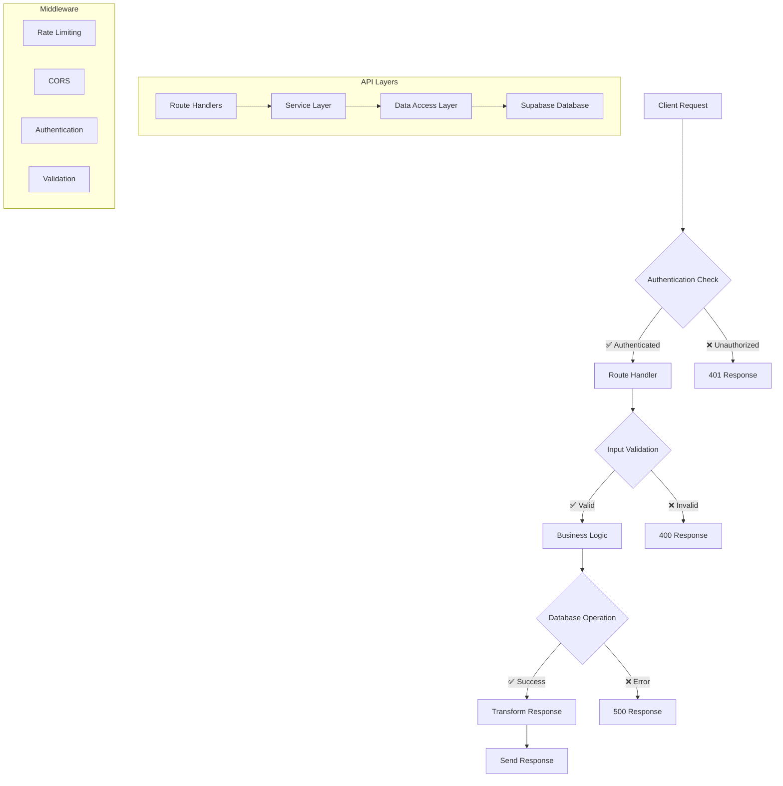

# 📡 API Reference

This document provides comprehensive documentation for all API endpoints in the Food Truck Finder application.

---

## 🏗️ **API Architecture**



---

## 🔑 **Key Design Principles**

- **GitHub Actions First**: The system uses GitHub Actions workflows for automated data processing instead of deprecated Vercel CRON jobs
- **Resilience & Fallbacks**: Every external dependency has defined fallback strategies to ensure high availability
- **Monitor Everything**: Comprehensive endpoints for monitoring system health, API usage, and pipeline performance
- **Scalability by Default**: Built on serverless architecture to handle variable load without performance degradation

---

## 🔐 **Authentication**

### **Authentication Methods**
- **Session-based**: Supabase Auth with cookie-based sessions
- **API Key**: For server-to-server communication
- **Role-based**:
    - **User**: Standard access for public consumers. Can view all public data.
    - **Admin**: Can manage food trucks, view system metrics, and trigger manual operations.
    - **Super Admin**: Has full system control, including user management and system-wide configurations.

### **Authentication Headers**
```http
Authorization: Bearer <jwt_token>
Content-Type: application/json
```

---

## 🛣️ **Public API Endpoints**

### **Search Food Trucks**
```http
GET /api/search
```

**Query Parameters:**
- `q` (string, optional): Search term for food truck names.
- `cuisine` (string, optional): Filter by cuisine type.
- `openNow` (boolean, optional): Filter for food trucks that are currently open.
- `lat` (number, optional): Latitude for location-based search.
- `lng` (number, optional): Longitude for location-based search.
- `radius` (number, optional): Search radius in kilometers.

**Example Request:**
```bash
curl -X GET "https://your-app.com/api/search?q=taco&lat=47.6062&lng=-122.3321&radius=10&openNow=true" \
     -H "Content-Type: application/json"
```

**Response:**
```json
{
  "trucks": [
    {
      "id": "truck-123",
      "name": "Taco Paradise",
      "description": "Authentic Mexican street tacos",
      "current_location": {
        "lat": 47.6062,
        "lng": -122.3321,
        "address": "123 Main St, Seattle, WA",
        "timestamp": "2024-01-01T12:00:00Z"
      },
      "cuisine_type": ["Mexican", "Street Food"],
      "price_range": "$$",
      "data_quality_score": 95
    }
  ],
  "total": 1,
  "filters": {
    "query": "taco",
    "cuisine": null,
    "openNow": true,
    "location": {
      "lat": 47.6062,
      "lng": -122.3321
    },
    "radius": 10
  }
}
```

### **Get All Food Trucks**
```http
GET /api/trucks
```

**Description:**
Retrieves a paginated list of all food trucks in the system.

**Query Parameters:**
- `limit` (number, optional, default: 50): The maximum number of food trucks to return.
- `offset` (number, optional, default: 0): The number of food trucks to skip before starting to collect the result set.

**Response:**
```json
{
  "trucks": [
    {
      "id": "truck-123",
      "name": "Taco Paradise",
      "description": "Authentic Mexican street tacos",
      "cuisine_type": ["Mexican", "Street Food"]
    }
  ],
  "total": 1
}
```

### **Get Food Truck Details**
```http
GET /api/trucks/[id]
```

**Path Parameters:**
- `id` (string): Unique food truck identifier

**Example Request:**
```bash
curl -X GET "https://your-app.com/api/trucks/truck-123" \
     -H "Content-Type: application/json"
```

**Response:**
```json
{
  "truck": {
    "id": "truck-123",
    "name": "Taco Paradise",
    "description": "Authentic Mexican street tacos with fresh ingredients",
    "current_location": {
      "lat": 47.6062,
      "lng": -122.3321,
      "address": "123 Main St, Seattle, WA",
      "timestamp": "2024-01-01T12:00:00Z"
    },
    "cuisine_type": ["Mexican", "Street Food"],
    "price_range": "$$",
    "data_quality_score": 95,
    "operating_hours": {
      "monday": { "open": "11:00", "close": "21:00" },
      "tuesday": { "open": "11:00", "close": "21:00" }
    },
    "menu": [
      {
        "name": "Tacos",
        "items": [
          {
            "name": "Carnitas Taco",
            "description": "Slow-cooked pork with cilantro and onions",
            "price": 3.50
          }
        ]
      }
    ]
  }
}
```

### **Create Food Truck**
```http
POST /api/trucks
```

**Authentication Required**: Admin role or higher

**Request Body:**
A `FoodTruck` object without the `id`, `created_at`, and `updated_at` fields.

**Response:**
A JSON object containing a success message and the newly created `FoodTruck` object.

### **Update Food Truck**
```http
PUT /api/trucks/[id]
```

**Authentication Required**: Admin role or higher

**Path Parameters:**
- `id` (string): Unique food truck identifier

**Request Body:**
A partial `FoodTruck` object with the fields to update.

**Response:**
A JSON object containing a success message and the updated `FoodTruck` object.

---

## 👑 **Admin API Endpoints**

**Authentication Required**: Admin role or higher

### **Admin Dashboard Data**
```http
GET /api/admin/dashboard
```

**Query Parameters:**
- `section` (string, optional): The specific section of the dashboard to retrieve. Can be one of `overview`, `scraping`, `processing`, `quality`, `usage`. If not provided, all sections are returned.

**Response:**
A JSON object containing the dashboard data. The structure depends on the `section` query parameter.

**Example Response (overview section):**
```json
{
  "overview": {
    "totalTrucks": 150,
    "recentTrucks": [
      {
        "id": "truck-123",
        "name": "Taco Paradise"
      }
    ],
    "averageQuality": 0.85,
    "verifiedTrucks": 120,
    "pendingTrucks": 30,
    "lastUpdated": "2024-01-01T12:00:00Z"
  }
}
```

### **Data Quality Management**
```http
GET /api/admin/data-quality
POST /api/admin/data-quality
```

**GET Request Query Parameters:**
- `action` (string, optional): The action to perform. Can be `stats` or `assess`. Defaults to `stats`.
- `truckId` (string, optional): The ID of the food truck to assess. Required if `action` is `assess`.

**POST Request Body:**
- `action` (string): The action to perform. Can be `update-single`, `batch-update`, or `recalculate-all`.
- `truckId` (string, optional): The ID of the food truck to update. Required if `action` is `update-single`.

### **Automated Cleanup**
```http
GET /api/admin/automated-cleanup
POST /api/admin/automated-cleanup
```

**GET Request Query Parameters:**
- `action` (string, optional): Can be `status`, `schedules`, `history`, or `preview`. Defaults to `status`.
- `limit` (number, optional): Maximum number of history records to return. Used with `action=history`.
- `operations` (string, optional): Comma-separated list of operations to preview. Used with `action=preview`.

**POST Request Body:**
- `action` (string): Can be `run_scheduled`, `run_immediate`, `schedule_cleanup`, `update_schedule`, or `delete_schedule`.
- `options` (object, optional): Action-specific options.

### **Scraping Metrics**
```http
GET /api/admin/scraping-metrics
```

**Response:**
```json
{
  "success": true,
  "data": {
    "scrapingJobs": {
      "active": 2,
      "completed": 1180,
      "failed": 70,
      "pending": 10
    },
    "dataQuality": {
      "averageScore": 0.85,
      "totalTrucks": 150,
      "recentChanges": 5
    },
    "systemHealth": {
      "status": "healthy",
      "uptime": 3600,
      "lastUpdate": "2024-01-01T12:00:00Z"
    }
  },
  "timestamp": "2024-01-01T12:00:00Z"
}
```

---

## 🔄 **Pipeline API Endpoints**

### **Manual Scraping**
```http
POST /api/scrape
```

**Authentication Required**: Admin role or higher

**Request Body:**
- `source` (string, optional): Specific source to scrape
- `limit` (number, optional): Maximum number of jobs to process

### **Enhanced Pipeline**
```http
POST /api/enhanced-pipeline
```

**Authentication Required**: Admin role or higher

**Request Body:**
- `mode` (string): Can be `full`, `discovery-only`, `processing-only`, or `location-specific`
- `location` (string, optional): Target city for location-specific mode

### **Process Jobs**
```http
POST /api/process-jobs
```

**Authentication Required**: Admin role or higher

**Request Body:**
- `limit` (number, optional, default: 10): Maximum number of jobs to process

---

## 🚫 **Deprecated Endpoints**

### **Legacy CRON Endpoints (Deprecated)**
```http
POST /api/cron/auto-scrape      # Returns 410 Gone
POST /api/cron/quality-check    # Returns 410 Gone
```

**Status**: These endpoints have been deprecated in favor of GitHub Actions workflows.

**Migration Info**: Use GitHub Actions workflow `.github/workflows/scrape-food-trucks.yml` for automated data processing.

### **API Documentation (Secured)**
```http
GET /api/docs                   # Returns 404 for security
```

**Status**: API documentation has been removed from public access for security reasons.

---

## 📊 **Response Status Codes**

- **200**: Success
- **201**: Created successfully
- **400**: Bad request (validation error)
- **401**: Unauthorized (authentication required)
- **403**: Forbidden (insufficient permissions)
- **404**: Not found
- **405**: Method not allowed
- **410**: Gone (deprecated endpoint)
- **500**: Internal server error

---

## 🔧 **Error Handling**

All endpoints return errors in the following format:

```json
{
  "success": false,
  "error": "Error type",
  "message": "Human-readable error message",
  "details": "Additional error context (if available)"
}
```

---

## 📈 **Rate Limiting**

- **Public endpoints**: 100 requests per minute per IP
- **Authenticated endpoints**: 1000 requests per minute per user
- **Admin endpoints**: 500 requests per minute per admin user

Rate limit headers are returned with each response:
```http
X-RateLimit-Limit: 100
X-RateLimit-Remaining: 95
X-RateLimit-Reset: 1640995200
```

---

*Last Updated: January 2025*  
*For questions about API usage, please contact the development team.*
