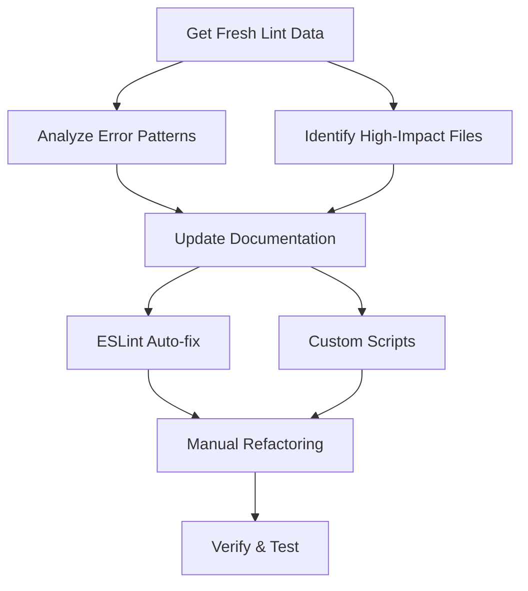

# Food Truck Finder - Developer Guide

A comprehensive development guide consolidating project overview, governance protocols, workflow standards, and best practices for the Food Truck Finder application.

## Table of Contents

- [Project Overview](#project-overview)
- [Zero-Trust Development Protocols](#zero-trust-development-protocols)
  - [Planning Protocol](#planning-protocol)
  - [Impact Analysis & Cross-Reference](#impact-analysis--cross-reference)
  - [WBS Standards](#wbs-standards)
- [Linting & Code Quality Workflow](#linting--code-quality-workflow)
  - [Remediation Strategy](#remediation-strategy)
  - [Validation Cycles](#validation-cycles)
  - [Automated vs Manual Fixes](#automated-vs-manual-fixes)
- [Secrets & Environment Management](#secrets--environment-management)
  - [Environment Variables](#environment-variables)
  - [Dotenv Best Practices](#dotenv-best-practices)
  - [Security Guidelines](#security-guidelines)
- [Supabase Best Practices](#supabase-best-practices)
  - [Configuration](#configuration)
  - [Migration Management](#migration-management)
  - [Row Level Security](#row-level-security)
- [Component Development Guidelines](#component-development-guidelines)
  - [Props Validation](#props-validation)
  - [Type Safety](#type-safety)
  - [Architecture Patterns](#architecture-patterns)
- [Documentation Structure](#documentation-structure)
- [Quick Reference](#quick-reference)

---

## Project Overview

The Food Truck Finder is a Next.js application designed to help users discover and track food trucks in their area. Built with TypeScript, Supabase, and modern React patterns, the project emphasizes type safety, code quality, and systematic development practices.

**Key Technologies:**
- **Frontend:** Next.js 14, React 18, TypeScript, Tailwind CSS
- **Backend:** Supabase (PostgreSQL), Next.js API Routes
- **Authentication:** Supabase Auth
- **Deployment:** Vercel
- **Code Quality:** ESLint, TypeScript strict mode, custom linting rules

---

## Zero-Trust Development Protocols

### Planning Protocol

The project follows a **"Never Trust, Always Verify"** approach to development:

#### Core Principles
- **Plan Fractally:** Break down every task into smallest possible, independently verifiable components
- **Anticipate Failure:** For every action, identify potential failure points and define fallbacks
- **Measure Twice, Cut Once:** Prioritize exhaustive research before writing code

#### Git Workflow
1. **Create Feature Branch:** `feature/WBS-X.X-brief-description`
2. **Research & Refine:** Conduct exhaustive research, refine WBS with detailed notes
3. **Pre-Action Verification (PAV):** Verify current system state before changes
4. **Execute Atomic Action:** Perform single, well-defined action
5. **Post-Action Verification (PoAV):** Immediately verify outcome
6. **Document & Commit:** Atomic commits with descriptive messages
7. **Complete & Merge:** Merge feature branch after final verification

*For detailed protocols, see [Zero-Trust Planning Protocol](../.clinerules/zero-trust-planning-protocol.md)*

### Impact Analysis & Cross-Reference

Every code modification triggers systematic impact analysis:

#### Pre-Change Analysis
- **Associated Files:** List all files directly created, modified, or deleted
- **Affected Files:** Identify all dependent files (imports, consumers, tests)
- **Review Contracts:** Understand existing function signatures, types, component props

#### Post-Change Verification
- **Automated Checks:** Run after every 10-15 edits:
  - `npx tsc --noEmit`
  - `npx eslint .`
  - `npx jscpd .`
- **Manual Cross-Reference:** Verify type consistency, prop consistency, function signatures

*For complete protocol, see [Impact Analysis Protocol](../.clinerules/impact-analysis-protocol.md)*

### WBS Standards

All tasks must be broken down into detailed Work Breakdown Structure documents:

#### Requirements
- **Hierarchical & Numbered:** All tasks numbered (1.1, 1.1.1) with `[ ]` checkboxes
- **CCR Rating:** Each task rated 0-10 for Complexity, Clarity, Risk
- **Fractal Breakdown:** No task >4 Complexity/Risk or <8 Clarity without further breakdown
- **Detailed Guidance:** Specific, actionable implementation steps
- **Verification Steps:** Explicit commands/procedures to verify completion

*For complete standards, see [WBS Task Breakdown Guidelines](../.clinerules/wbs-task-breakdown.md)*

---

## Linting & Code Quality Workflow

### Remediation Strategy

Systematic approach to maintaining code quality through phased remediation:



#### Phase 1: Quick Wins (Automated)
- `sonarjs/prefer-read-only-props`
- `unicorn/no-null`
- `@typescript-eslint/no-unused-vars`
- `sonarjs/different-types-comparison`

#### Phase 2: Structural Refactoring (Manual)
- `max-lines-per-function`
- `sonarjs/cognitive-complexity`
- Function parameter reduction

#### Phase 3: Type Safety (Critical)
- `@typescript-eslint/strict-boolean-expressions`
- `@typescript-eslint/no-unsafe-*`
- Explicit type annotations

### Validation Cycles

Mandatory validation for EVERY task:

1. **Syntax & Compilation:** Verify syntax, TypeScript compilation
2. **Linting & Quality:** ESLint rules, no new errors
3. **Functional Verification:** Intended functionality works
4. **Integration Testing:** Imports/exports, type compatibility
5. **Performance & Side Effects:** No degradation or unintended effects

### Automated vs Manual Fixes

#### Safe for Automation (Tier 1)
- ESLint auto-fix
- Unused import/variable removal
- `@ts-expect-error` comment removal

#### Manual Only (Tier 4)
- Function extraction
- Complex logic changes
- Cognitive complexity reduction

*For comprehensive guide, see [Linting and Code Quality Guide](../docs/LINTING_AND_CODE_QUALITY_GUIDE.md)*

---

## Secrets & Environment Management

### Environment Variables

#### Naming Conventions
- **Client-side (Next.js):** Must use `NEXT_PUBLIC_` prefix
- **Server-side only:** No prefix required

```bash
# ✅ Correct - Client-side accessible
NEXT_PUBLIC_SUPABASE_URL=your_supabase_url
NEXT_PUBLIC_SUPABASE_ANON_KEY=your_anon_key

# ✅ Correct - Server-side only
SUPABASE_SERVICE_ROLE_KEY=your_service_role_key
```

#### Environment Structure
- **Development:** `.env.local` for local secrets
- **Production:** Platform-specific secret management (Vercel, GitHub Actions)
- **Never commit:** `.env*` files (except `.env.example`)

### Dotenv Best Practices

#### Proven Import Pattern
```javascript
// Load environment variables first
import dotenv from 'dotenv';
dotenv.config({ path: '.env.local' });

// Then import dependent modules
const { processScrapingJob } = await import('../lib/pipeline/processor.js');
```

#### Validation
```javascript
const requiredEnvVars = [
  'NEXT_PUBLIC_SUPABASE_URL',
  'NEXT_PUBLIC_SUPABASE_ANON_KEY',
  'SUPABASE_SERVICE_ROLE_KEY'
];

for (const envVar of requiredEnvVars) {
  if (!process.env[envVar]) {
    throw new Error(`Missing required environment variable: ${envVar}`);
  }
}
```

### Security Guidelines

- **Never hardcode secrets:** Use environment variables exclusively
- **Production security:** Use platform-provided secret management
- **Cross-environment consistency:** Same variable names across environments
- **Fail fast:** Validate required variables at startup

*For complete guidelines, see [Secrets Management](../.clinerules/secrets-management.md)*

---

## Supabase Best Practices

### Configuration

#### Correct Environment Variables
```bash
# ✅ Client-side accessible
NEXT_PUBLIC_SUPABASE_URL=your_project_url
NEXT_PUBLIC_SUPABASE_ANON_KEY=your_anon_key

# ❌ Will not work client-side
SUPABASE_URL=your_project_url
```

### Migration Management

#### Fallback to Manual SQL
- When CLI tools fail consistently, generate manual SQL scripts
- Execute directly in Supabase dashboard SQL Editor
- Always verify changes with `SELECT` queries against `pg_*` catalog tables

#### Migration History Mismatch Resolution
1. Delete all local migration files in `supabase/migrations`
2. Run `npx supabase migration repair --status reverted` for each migration
3. Run `npx supabase db pull` to generate clean schema
4. Re-create new migrations with fresh timestamps

#### Idempotent Migrations
```sql
-- ✅ Safe to run multiple times
CREATE TABLE IF NOT EXISTS profiles (
  id UUID PRIMARY KEY,
  user_id UUID REFERENCES auth.users(id)
);

-- ✅ Safe index creation
CREATE INDEX IF NOT EXISTS idx_profiles_user_id ON profiles(user_id);
```

### Row Level Security

#### Mandatory RLS for User Data
```sql
-- Enable RLS immediately after table creation
ALTER TABLE public.profiles ENABLE ROW LEVEL SECURITY;

-- Create user-specific policy
CREATE POLICY "Users can view their own profile"
ON public.profiles FOR SELECT
USING ( auth.uid() = user_id );
```

*For complete practices, see [Supabase Best Practices](../.clinerules/supabase-configuration.md)*

---

## Component Development Guidelines

### Props Validation

#### Explicit Prop Types
```typescript
interface TruckCardContentProps {
  readonly truckName: string;
  readonly cuisineType: string;
  readonly averageRating: number;
  readonly imageUrl: string | undefined;
}

const TruckCardContent: React.FC<TruckCardContentProps> = ({ 
  truckName, 
  cuisineType, 
  ...props 
}) => {
  if (!truckName || !cuisineType) {
    return <div>Invalid Truck Information</div>;
  }
  
  const displayImage = props.imageUrl ?? DEFAULT_TRUCK_IMAGE;
  // ... render component
};
```

#### Fallback Mechanisms
- Use default prop values for optional props
- Implement graceful fallback behaviors
- Log validation errors to ErrorBoundary

### Type Safety

#### Explicit Type Annotations
```typescript
// ✅ Explicit typing
const data: MyType = await response.json();

// ✅ Type guards for unknown data
const body: unknown = await request.json();
if (typeof body === 'object' && body !== null && 'action' in body) {
  const action = (body as { action: string }).action;
}
```

#### Handle Nullish Values Explicitly
```typescript
// ✅ Explicit comparisons
if (value !== undefined && value !== null) { /* ... */ }

// ✅ Nullish coalescing
const result = value ?? fallbackValue;

// ❌ Avoid implicit coercion
if (value) { /* ... */ }
```

### Architecture Patterns

#### Feature-First Architecture
```
components/
├── ui/                    # Shared UI components
├── feature-name/          # Feature-specific components
└── layout/                # Layout components
```

#### Component Separation
- Use dedicated hooks for business logic
- Extract complex logic into service/helper functions
- Maintain single responsibility principle

*For detailed guidelines, see [Component Props Validation](../.clinerules/component-props-validation.md) and [Development Conventions](../.clinerules/dev-conventions.md)*

---

## Documentation Structure

The documentation is organized into numbered directories for easy navigation:

### 📋 [00_project-overview/](./00_project-overview/)
High-level project information including vision, goals, and business requirements.

### 🚀 [01_getting-started/](./01_getting-started/)
Everything you need to get up and running quickly, including setup instructions and quick start guides.

### 🏗️ [02_architecture/](./02_architecture/)
System architecture, component relationships, and design patterns.

### ⚙️ [03_backend/](./03_backend/)
Backend-specific documentation including APIs, database design, and server configuration.

### 🎨 [04_frontend/](./04_frontend/)
Frontend documentation covering components, UI/UX guidelines, and client-side implementation.

### 🚢 [05_deployment-ops/](./05_deployment-ops/)
Deployment procedures, environment configuration, and operations documentation.

### 📚 [06_guides/](./06_guides/)
Practical how-to guides, tutorials, and troubleshooting documentation.

### 📜 [99_rules-and-governance/](./99_rules-and-governance/)
Project governance, coding standards, and quality assurance processes.

### 🗃️ [_archive/](./_archive/)
Archived and deprecated documentation (automatically ignored in Git).

---

## Quick Reference

### Essential Commands
```bash
# Type checking
npx tsc --noEmit

# Linting
npx eslint .
npx eslint . --fix

# Code duplication detection
npx jscpd .

# Development server
npm run dev

# Build
npm run build
```

### File Ownership & Coordination

| File Category | Ownership | Coordination Required |
|---------------|-----------|----------------------|
| `lib/supabase.ts` | Single Agent | ✅ Required |
| `app/api/pipeline/` | Single Agent | ✅ Required |
| `components/` | Multi-Agent | 📋 Recommended |
| `app/admin/` | Multi-Agent | 📋 Recommended |

### Navigation Links

- **New to the project?** Start with [01_getting-started/](./01_getting-started/)
- **Understanding the system?** Check [02_architecture/](./02_architecture/)
- **Backend development?** Visit [03_backend/](./03_backend/)
- **Frontend development?** Explore [04_frontend/](./04_frontend/)
- **Deployment & ops?** See [05_deployment-ops/](./05_deployment-ops/)
- **Guides & tutorials?** Browse [06_guides/](./06_guides/)
- **Governance & rules?** Review [99_rules-and-governance/](./99_rules-and-governance/)

### Related Documentation

- [API Reference](./03_backend/API_REFERENCE.md) - Comprehensive API endpoint documentation
- [Environment Variables](./05_deployment-ops/ENVIRONMENT_VARIABLES.md) - Configuration management
- [Deployment & Operations](./05_deployment-ops/README.md) - Current pipeline architecture
- [Legacy Documentation Migration](./LEGACY_DOCS_MIGRATION.md) - Migration status and tracking
- [Linting and Code Quality Guide](../docs/LINTING_AND_CODE_QUALITY_GUIDE.md)
- [Zero-Trust Planning Protocol](../.clinerules/zero-trust-planning-protocol.md)
- [Impact Analysis Protocol](../.clinerules/impact-analysis-protocol.md)
- [Supabase Best Practices](../.clinerules/supabase-configuration.md)
- [Component Guidelines](../.clinerules/component-props-validation.md)
- [Development Conventions](../.clinerules/dev-conventions.md)
- [Secrets Management](../.clinerules/secrets-management.md)

---

## Contributing to Documentation

When adding new documentation:
1. Place it in the appropriate numbered directory
2. Follow the existing naming conventions
3. Update relevant README.md files
4. Consider cross-linking related documentation
5. Update this guide's table of contents if adding major sections

## Archive Policy

Outdated documentation should be moved to the `_archive/` directory rather than deleted to maintain project history while keeping active documentation clean.

---

**Last Updated:** January 2025  
**Maintained By:** Food Truck Finder Development Team  
*This documentation structure follows a logical progression from high-level overview to specific implementation details, making it easy for developers of all experience levels to find the information they need.*
